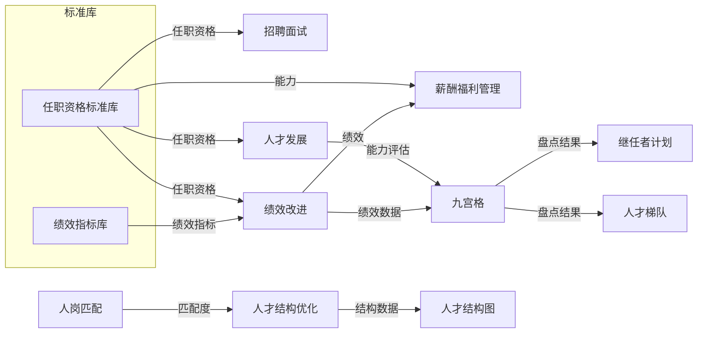
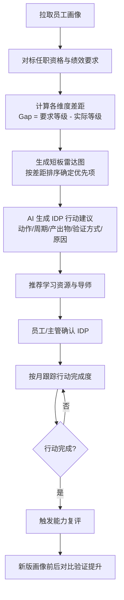
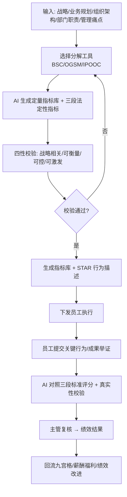
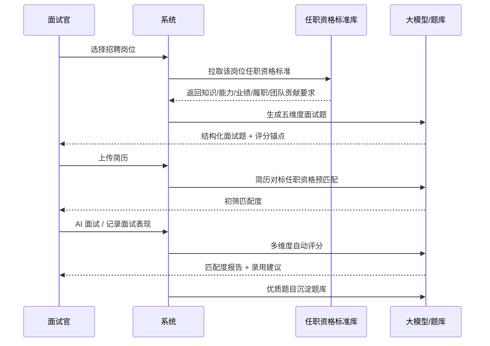
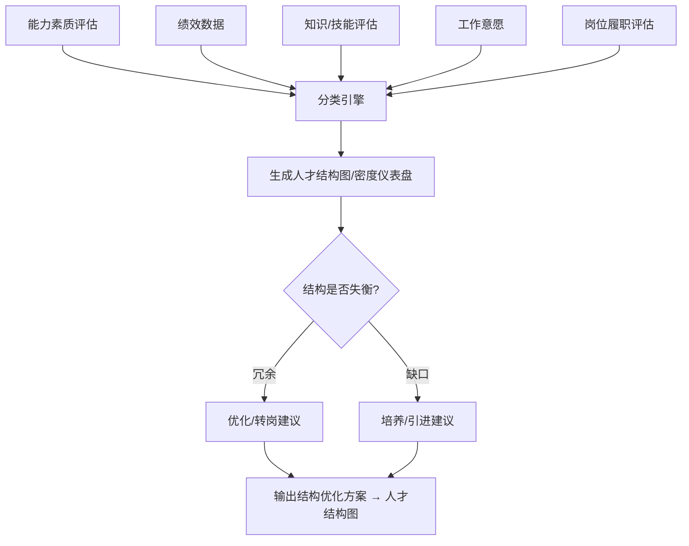
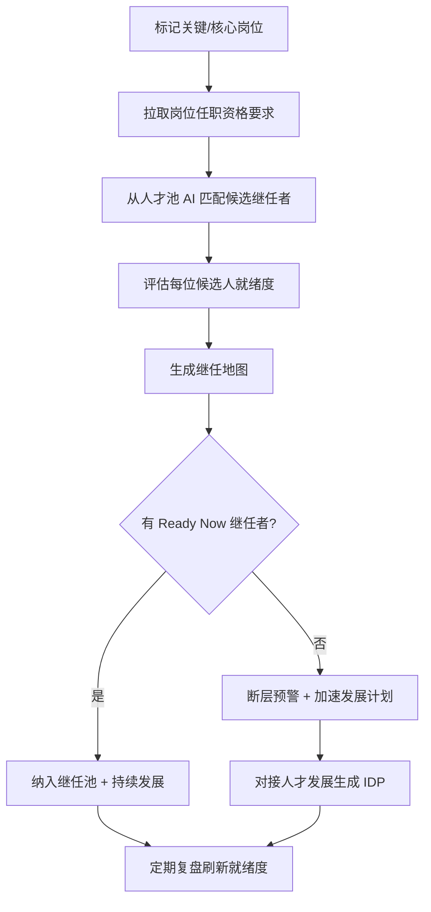
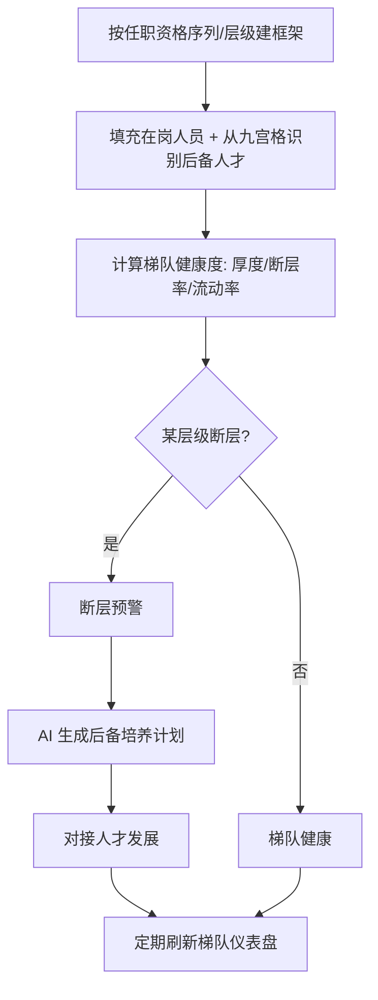
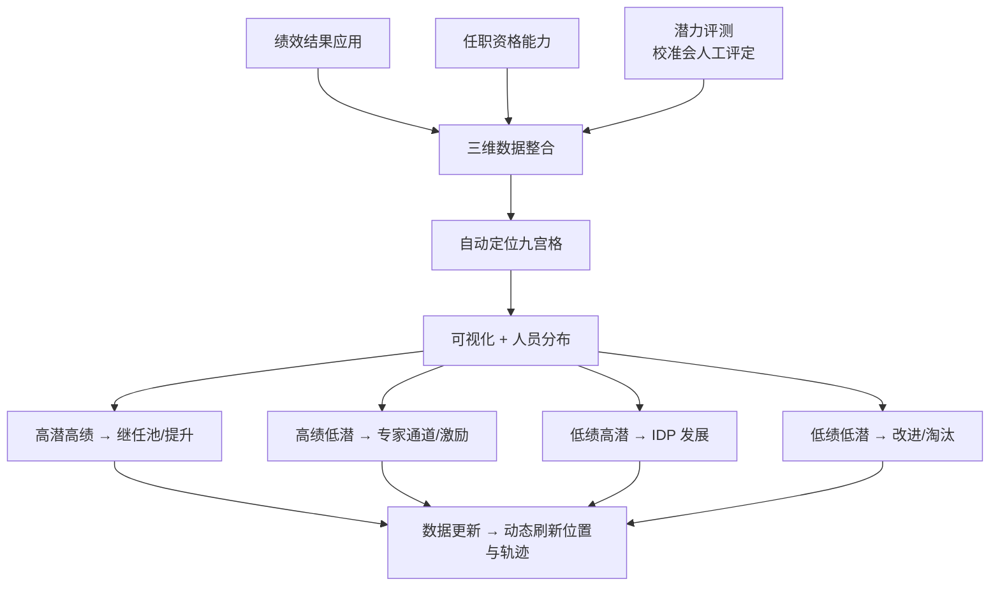
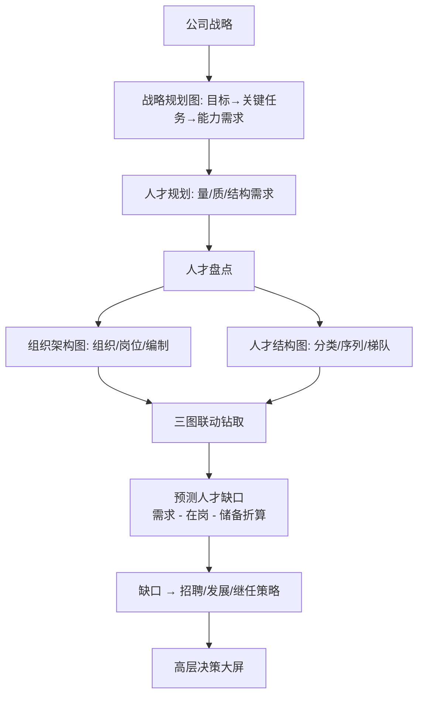

```mermaid
flowchart TD
    A[岗位任职资格标准] --> C[向量化/要素对齐]
    B[员工人才画像] --> C
    C --> D[加权匹配度计算<br/>缺维不计入分母]
    D --> E[生成五要素差距热力图]
    E --> F{匹配度阈值判断}
    F -- 高 ≥80% --> G[匹配良好]
    F -- 中 --> H[观察/可培养]
    F -- 低 <60% --> I[错位预警 → 提升或调岗]
    I --> J[调岗/内部活水推荐]
    J --> K[团队快速组建]
```

# AI+HR 智能体系统 PRD（以任职资格与绩效管理为中心）

**产品定位：**一套「人才标准驱动的决策型 HR 操作系统」——以**任职资格（能力评价）＋绩效管理（业绩评价）**为双中心，自动生成**人才画像**，并由画像派生**十大应用**的建议动作。系统按三支柱角色（员工/管理者/COE 五板块/HRBP/SSC/评委/高管/管理员，见「角色」章）提供从「看标准、看差距」到「做判断、做动作」的完整闭环；AI 只承担「内容生成」与「判断辅助」两类能力，人工审核与拍板不可省略。

# 背景与目标

## 背景与问题

传统 HR 各模块（招聘、绩效、人才发展、盘点、继任、薪酬等）处于“数据割裂、标准不一、依赖个人经验”的状态，难以支撑战略落地。核心痛点可归纳为四类，本系统即围绕它们设计：

- **人才标准散落**：岗位职责、任职资格、绩效规则分散在文档与表格中，不可计算、不可比对，人才水平无法统一衡量。知识、能力、业绩、履职、团队贡献等评价缺乏统一的任职资格标准，各模块各说各话。
- **靠主观判断**：IDP 套话、绩效拍脑袋、面试凭感觉、人岗匹配靠经验、SABC 绩效分类手工统计，客观性与一致性不足。晋升认证、调薪资格、离职风险、继任补位多凭主管印象，缺乏可追溯的数据依据。
- **流程不闭环**：各类标准制定后无人跟踪维护、盘点一年一次静态滞后、结果不落地、缺行为举证与持续刷新机制。人才盘点依赖人工拉数据、手工排九宫格，周期长、口径不统一，拿到的人才结构图常常滞后一个季度。
- **数据不流转**：招聘、培训、绩效、薪酬、晋升、盘点各成孤岛，同一员工的数据在多个系统重复维护且互相不一致，无法形成“战略→组织→人才”的传导链路。

## 产品定位

以任职资格与绩效管理为统一标尺、以统一数据底座为支撑的AI原生HR操作系统，实现一个底座、十大应用的集成与数据流转，把人力资源六大模块整合成一套体系化、结构化的系统。

## 目标与成功指标

| 目标       | 衡量指标                                                                               | 说明              |
| -------- | ---------------------------------------------------------------------------------- | --------------- |
| **底座统一** | 以任职资格五要素（基础条件/知识技能/能力素质/业绩产出/岗位履职/团队贡献）为统一标尺，建成统一数据底座（任职资格标准库 + 绩效指标标准库 + 全员人才档案 + AI 中台） | 一套标准驱动十大应用，消除各模块口径不一 |
| **效率提升** | IDP 人均制定耗时缩短至 15 分钟；绩效指标制定缩短至 1 天；人岗匹配分析从小时级缩短至秒级；薪酬测算耗时下降 60% | AI 生成 + 规则引擎自动化，替代手工拉数与套模板 |
| **判断留痕** | 晋升、调薪、继任三类决策 100% 附带数据依据 | 依据来自画像与规则引擎，可追溯 |
| **动作闭环** | 盘点结果应用转化率 ≥60%、IDP 季度跟踪完成率 ≥75%、关键岗位继任者覆盖率 ≥90% | 差距→动作→回看形成闭环 |
| **质量提升** | IDP 自动生成覆盖率 ≥90%、能力短板识别准确率 ≥80%、九宫格自动定位覆盖率 100% | AI 草稿一律经人工审核，保障客观性 |

## 设计原则

- **标准先行**：先建可计算的任职资格标准（基础条件/知识技能/能力素质/业绩产出/岗位履职/团队贡献），再谈 AI 与自动化。
- **数据联动**：一处录入、多处生效——职级变动自动触发薪酬、认证记录自动回写画像。
- **动作闭环**：系统不只展示差距，还推荐动作、跟踪执行、回看效果。
- **人机分工**：AI 生成内容必须人工审核；AI 辅助决策只给依据，人拍板。

# 用户与场景

## 角色（HR 三支柱模型，ADR-0014/0015）

产品上线后不再设单一「HR」角色。HR 职能按三支柱拆为 **COE 五板块 + HRBP + SSC** 共 7 个内置角色，另保留管理与系统固定角色；一人可兼多角，但同一时刻只有一个**激活角色**生效。

| 角色                                      | 核心诉求                | 数据范围                            | 主要使用场景                                         |
| --------------------------------------- | ------------------- | ------------------------------- | ---------------------------------------------- |
| **员工 employee**                         | 看清自己的发展路径、差距与学习任务   | 仅本人 self                        | 查职业生涯通道、看画像自评、领学习地图/IDP、提交认证举证                 |
| **部门领导 manager**                        | 掌握团队人岗差距并推动改进       | subtree：汇报链 ∪ 所领导部门子树           | 团队画像看板、人岗差距、初审、继任提名、IDP 辅导；部门领导身份按部门主数据自动授/收角  |
| **COE·干部管理 hr\_coe\_cadre**             | 干部任免、盘点与继任的制度 owner | global                          | 盘点校准、核心岗位/后备池/继任管理、IDP 与差距、Cockpit 问答          |
| **COE·绩效管理 hr\_coe\_perf**              | 绩效制度与结果运营           | global                          | 绩效结果录入、盘点校准、IDP 与差距、画像查看                       |
| **COE·薪酬激励 hr\_coe\_comp**              | 定薪、带宽与调薪            | global                          | 员工定薪数据读写、薪级带宽维护；唯一可见明文薪酬的 HR 板块                |
| **COE·招聘运营 hr\_coe\_recruit**           | 招聘与考试供给             | global                          | 招聘流程管理、排考与考试运营                                 |
| **COE·组织与人才发展 hr\_coe\_otd**            | 组织、标准、画像与认证制度 owner | global                          | 部门树维护、档案组织/基本字段编辑、标准库与发布、画像生成、盘点发起、题库试卷、认证小组安排 |
| **HRBP hrbp**                           | 嵌入业务的人力伙伴           | assigned\_depts：按授权部门（可多个、可含子树） | 所辖部门画像/盘点校准/IDP 辅导/差距分析/继任提名/招聘需求提报            |
| **SSC ssc**                             | 事务共享服务              | global（只读名册，薪酬/绩效掩码）            | 账号开通停用重置、审计日志查看与数据导出                           |
| **认证评委 reviewer / 评审组长 lead\_reviewer** | 对派单对象评审             | self（仅被派单申请）                    | 评审表决、组长终裁与 AI 建议查看；只评审、不获得常规 HR 读写权            |
| **任职资格管理委员会 committee**                 | 高等级认证终审             | global                          | 认证小组安排、终裁发布；不默认可见薪酬明文                          |
| **高管 exec**                             | 看三张图做决策             | global                          | 盘点校准、画像查看、Cockpit 问答；不默认可见薪酬明文                 |
| **租户管理员 tenant\_admin**                 | 本租户全部配置             | global（通配权限 \*）                 | 角色与权限配置、配置中心、模板、用量与导出                          |
| **平台管理员 platform\_admin**               | 平台运营                | platform（无员工明文）                 | 租户开通/封禁、层级框架等平台级资产                             |

> 演示/小型租户可使用系统预设自定义角色\*\*「综合 HR（一人全包）」\*\*（七角色权限并集，global），随产品内置但不落枚举，租户可随时弃用。

## RBAC 权限模型

**三重判定**：每个请求在接口层强制「**租户隔离 × 激活角色权限点 × 数据范围**」校验。

1. **单一激活角色，不做并集**：用户可拥有多个角色引用，但权限仅由当前激活角色决定；激活角色来自 `X-Active-Role` 请求头或用户默认设置，服务端校验该角色确属本人，伪造/越权头一律 403。
2. **权限点目录（31 个点，7 组）**：权限点随代码版本发布，租户只能在目录内组合，不能自创；平台新增权限点对既有自定义角色默认拒绝。

| 权限组                         | 权限点                                                                                                                                                                                                          |
| --------------------------- | ------------------------------------------------------------------------------------------------------------------------------------------------------------------------------------------------------------ |
| 组织与档案 org\_employee         | org.view、org.dept.manage、employee.view、employee.account.manage、employee.field.org.edit、employee.field.basic.edit、employee.field.perf.view、employee.field.perf.edit、employee.salary.view、employee.salary.edit |
| 标准与画像 standard\_profile     | standard.manage、standard.publish、mapping.manage、comp.band.manage、profile.view、profile.generate、comp.rule.manage（P2 新增：调薪矩阵/固浮比/SABC 常量）、bonus.manage（P2 新增：绩效奖金方案）                                           |
| 盘点与继任 inventory\_succession | inventory.manage、inventory.calibrate、succession.manage、succession.nominate                                                                                                                                   |
| 发展与差距 development           | idp.coach、gap.manage、panel.manage                                                                                                                                                                            |
| 选聘与考试 selection\_exam       | recruit.manage、recruit.demand、exam.paper.manage、exam.operate                                                                                                                                                 |
| 洞察与审计 insight\_audit        | cockpit.ask、audit.view、audit.export                                                                                                                                                                          |
| 系统 system                   | role.manage                                                                                                                                                                                                  |

1. **数据范围四档**：`self` 仅本人 / `subtree` 汇报链 ∪ 部门子树（领导身份与授权变更联动授/收 manager 角色）/ `assigned_depts` 授权部门清单（HRBP，一人可服务多个不相邻部门，可勾选含子树）/ `global` 全租户。**范围外的员工统一返回 404**（不返回 403，避免存在性泄露），由 `can_access_employee`/`apply_employee_scope` 单点推导。
2. **字段级掩码**：数据可见 ≠ 字段可见。明文定薪仅 `employee.salary.view`（COE·薪酬激励 / 通配管理员 / 本人）；绩效等级仅 `employee.field.perf.view` 或本人；SSC 可见名册但薪酬绩效均掩码。
3. **租户自定义角色**：可克隆 7 个三支柱/经理模板后改名、改权限点组合、改数据范围；固定角色（员工/评委/组长/管委会/高管/两类管理员）不可克隆。角色与授权管理走 `/roles/*` API（`role.manage`），最后一个通配管理员禁止摘除（422 防自锁）。
4. **全程留痕**：授角、收角、激活切换、部门授权变更、自定义角色增删改均写审计日志；无单一实体的批量动作 entity\_id 可空。

### 五体系 × 三支柱模块地图

| 业务体系        | 主责 COE                                                      | 协同角色                                               | 对应产品模块                                         |
| ----------- | ----------------------------------------------------------- | -------------------------------------------------- | ---------------------------------------------- |
| 任职资格标准与认证   | hr\_coe\_otd（标准/发布/小组安排/profile.generate）                   | committee 终审、manager 初审、reviewer/lead\_reviewer 评审 | 任职资格标准库、版本发布、认证申请与举证、认证审核台、路由评审/答辩、七维人才画像      |
| 绩效与人才盘点     | hr\_coe\_perf（绩效录入）、hr\_coe\_cadre（盘点继任制度）                  | otd 发起盘点、hrbp/manager 校准、exec 看板洞察                 | 绩效结果导入、盘点批次、初排校准、九宫格、三张图驾驶舱、Cockpit 问答         |
| 继任与梯队       | hr\_coe\_cadre                                              | manager/hrbp 提名、exec 决策                            | 核心岗位、继任矩阵、后备梯队池、AB 角、离职/断层风险                   |
| 发展与差距       | hr\_coe\_perf / hr\_coe\_cadre / hrbp（idp.coach、gap.manage） | manager 团队辅导、employee 本人执行                         | 差距分析、动作路由、IDP、学习地图、考试（运营归 otd/recruit）、辅导与改进看板 |
| 招聘与薪酬激励     | hr\_coe\_recruit（招聘/考试运营）、hr\_coe\_comp（定薪/带宽/调薪）           | hrbp 提招聘需求、exec 调薪审批（金额对其掩码）                       | 招聘工作台、面试题库、考试中心、等级工资表、薪级带宽、调薪方案/审批/套改汇报        |
| 组织与共享服务（底座） | hr\_coe\_otd（组织/档案）、ssc（账号/审计）                              | tenant\_admin 授权                                   | 组织架构、岗位管理、职级通道、员工花名册与档案、角色与权限管理、配置中心、审计日志      |

**认证路由评审权限分离**：低等级认证由部门领导单审；中等等级由认证小组（评委 3–5 人）评审表决；高等级由管委会评审。评审权与 HR 运营权分离：评委/组长只在被派单申请上可见材料，表决留痕但只有组长终裁/管委会发布才落库生效。

## 核心场景

| 场景                  | 角色          | 涉及模块                    |
| ------------------- | ----------- | ----------------------- |
| 员工年中沟通任职资格与职业通道意愿   | 员工/管理者      | 通道管理、意愿确认               |
| P3 晋升认证（举证+答辩+小组评审） | HR/员工/认证小组  | 认证管理、画像比对               |
| 年度人才盘点与九宫格定位        | HR/高管       | 盘点、九宫格、人才结构图            |
| 年度调薪矩阵与绩效奖金方案       | COE·薪酬激励/高管 | 薪酬激励（模块八）：调薪矩阵、奖金包测算与审批 |
| 关键岗位离职风险预警与补位       | HR/高管       | 继任者计划、离职风险预警            |

# 总体架构

<br />

## 端到端数据流

1. **输入**：战略规划与组织架构 → 部门职责/岗位职责 → 岗位价值评估（职级/职等）。
2. **建标准**：岗位履职（关键任务+完成标准+履职四级）、知识技能（三分类四档）、能力素质（能力词典+关键行为）、团队贡献、基本条件，形成任职资格标准库；绩效侧建指标库与考核方案。
3. **汇聚画像**：绩效结果（S/A/B/C/D）+ 标准认证结果 → 七维人才画像。
4. **盘点定位**：画像 → 人才盘点（业绩×能力×潜力）→ 九宫格 / 人才结构图。
5. **派生动**：十大应用按目的取用画像维度，产出改进动作（绩效改进、过程监督、补知识、做贡献、进梯队等）。
6. **效果回看**：动作执行结果回流画像，形成年度闭环。

### 应用间数据流转关系

下图描绘 HR 各应用模块（含两座标准库）之间的核心数据流转链路，体现「**标准先行 → 评价汇聚 → 盘点定位 → 派生动作**」的数据传导关系。



> 原始画板见 [docs/hr-data-flow.jpg](./hr-data-flow.jpg)。

**流转明细**：

| 源模块     | 目标模块   | 流转数据 | 说明                         |
| ------- | ------ | ---- | -------------------------- |
| 任职资格标准库 | 招聘面试   | 任职资格 | 履职/知识/能力/业绩标准直接转面试题与画像比对口径 |
| 任职资格标准库 | 人才发展   | 任职资格 | 学习地图、IDP 目标与差距依据标准库定义      |
| 任职资格标准库 | 绩效改进   | 任职资格 | 改进动作路由（履职/能力/知识短板）以标准库为标尺  |
| 任职资格标准库 | 薪酬福利管理 | 能力   | 能力等级参与定薪与调薪矩阵的能力维度判定       |
| 绩效指标库   | 绩效改进   | 绩效指标 | 考核卡、SABC 结果与 PIP 入口均取自指标库  |
| 人才发展    | 九宫格    | 能力评估 | 能力发展结果作为九宫格「能力轴」输入         |
| 绩效改进    | 九宫格    | 绩效数据 | 周期 SABC 作为九宫格「业绩轴」输入       |
| 绩效改进    | 薪酬福利管理 | 绩效   | 绩效系数驱动绩效奖金计发与年度调薪矩阵        |
| 九宫格     | 继任者计划  | 盘点结果 | 盘点定位输出进入核心岗位继任候选与补位        |
| 九宫格     | 人才梯队   | 盘点结果 | 高潜/绩优人员进入梯队池与 AB 角配置       |
| 人岗匹配    | 人才结构优化 | 匹配度  | 人岗差距数据驱动结构诊断与断层预警          |
| 人才结构优化  | 人才结构图  | 结构数据 | 结构分布数据汇入三张图驾驶舱             |

**设计要点**：① 两座标准库（任职资格 / 绩效指标）是全系统数据源头，所有评价与决策口径均由此派生；② 九宫格是人才盘点的汇聚节点，向上接收能力+绩效双轴数据，向下派生继任与梯队动作；③ 绩效改进是薪酬的唯一绩效口径入口，OKR/360 不进入薪酬计算（见模块二「工具分工」与模块八「取数边界」）；④ 数据单向流转、结果可回流画像，形成年度闭环。

## 混合架构：确定性 × Agentic 分工

**结论**：本系统不建议采用「一切皆 Agent」的纯 Agentic 架构，而是**混合架构**——Workflow 管骨架、规则引擎管闸门、Agent 管节点（编排与判断辅助）、人管最终决策。主链路（认证/盘点/调薪）用状态机 + BPM 确定性执行，保证可审计、可解释、防幻觉；Agent 只承担跨步编排、内容生成与判断辅助；晋升、调薪、降级等决策类输出一律经人工确认闸门。

### 分层职责

| 层        | 职责           | 执行方式                                          | 代表组件                                   |
| -------- | ------------ | --------------------------------------------- | -------------------------------------- |
| **编排层**  | 强流程推进与跨域任务规划 | Workflow 引擎（确定性）+ Orchestrator Agent（Agentic） | 认证/盘点/调薪 BPM；问答与跨域编排                   |
| **执行层**  | 规则计算与领域判断    | 确定性服务 + 领域 Agent                              | 规则引擎、画像引擎、差距引擎；招聘/发展/认证/盘点/继任/调薪 Agent |
| **能力层**  | 可插拔工具能力      | Skill Registry（技能包）                           | 出题、归因分析、文档汇报、报表看板、通知审批                 |
| **数据底座** | 可计算的人才标准     | 确定性存储                                         | 任职资格标准库、绩效中心、画像库、组织岗位主数据               |
| **决策闸门** | 人工确认         | 人（贯穿执行层）                                      | AI 草稿 → 确认 → 生效回写                      |

### Agent 应用场景清单

| 场景            | 形态           | 说明                                                     |
| ------------- | ------------ | ------------------------------------------------------ |
| **AI 出题与组卷**  | 单点 LLM       | 按知识四档出题（了解/掌握/熟练掌握/精通），AI 草稿需 HR 审核后发布                 |
| **认证材料预审**    | 单 Agent + 工具 | 跨模块拉取举证（履职产出/关键行为/考试记录），提示缺漏，生成答辩问题                    |
| **盘点归因与策略**   | 单 Agent + 工具 | 画像+绩效数据归因，生成九宫格差异化策略初稿                                 |
| **调薪与奖金建议**   | 单 Agent + 工具 | 矩阵测算（SABC×带宽渗透率、75 分位停涨）与奖金测算（系数×奖金包）完成后，起草建议理由与高管汇报材料 |
| **继任与离职风险**   | 单 Agent + 工具 | 风险信号 → 原因分析 → 干预建议（72 小时补位配套）                          |
| **驾驶舱问答**     | Agent + RAG  | 自然语言提问（如「研发部为何是哑铃型」）→ 查画像库 → 生成可溯源解释                   |
| **招聘 JD 与匹配** | 单 Agent + 工具 | 生成 JD、面试题，候选人画像匹配与面试纪要                                 |

### Multi-agent 协作纪律

1. **Task 化受限协作**：子任务无状态、结果回写数据库，不开放 Agent 间自由多轮互聊，避免状态失控。
2. **数据引用防幻觉**：Agent 输出必须引用画像库/标准库数据并可溯源，禁止脱离数据生成结论。
3. **人工确认闸门**：晋升、调薪、降级等决策类输出一律「草稿 → 确认 → 生效」，全程留痕可审计。

### Skill Registry 设计

Skill（技能包）统一结构：**{ 触发条件、输入 Schema、绑定工具/API、执行逻辑（含提示词模板）、输出 Schema、审核要求 }**。HR 规则按企业差异做成可插拔配置（标准库模板、规则包、出题模板均以能力包形式加载）。

| 技能包            | 输入绑定          | 输出             | 审核要求     |
| -------------- | ------------- | -------------- | -------- |
| **出题 Skill**   | 标准库知识点 + 掌握层级 | 试卷 JSON（含答案要点） | HR 审核后发布 |
| **归因分析 Skill** | 画像 + 绩效数据     | 差距原因与建议        | 业务部门确认   |
| **文档汇报 Skill** | 数据 + 口径       | 汇报材料 / 文档草稿    | 使用人确认    |
| **报表看板 Skill** | 画像库查询         | 九宫格、三张图数据      | 数据口径校核   |
| **通知审批 Skill** | 流程节点事件        | 待办与消息          | 免审（系统事件） |
| **画像查询 Skill** | 自然语言          | 结构化查询结果        | 免审（只读）   |

# SaaS 化方案

**结论**：产品定位为 AI SaaS 时，核心资产（双中心 → 人才画像 → 十大应用、状态机、DDL、接口设计）全部复用，业务逻辑不动；新增**多租户、配置中心、套餐计费、安全合规**四类平台能力。规则引擎升级为规则配置引擎，AI 能力走统一服务网关（多模型 + 租户配额 + 审核）。

## 多租户模型

所有核心表（标准库/绩效中心/画像库/主数据）增加 **tenant\_id** 分区键，接口鉴权升级为「租户 × 角色」双层；数据隔离分三级，随客户规模升级。

| 隔离级别          | 适用       | 实现方式                            |
| ------------- | -------- | ------------------------------- |
| **逻辑隔离**      | 中小客户（默认） | tenant\_id 分区 + 行级权限，共享资源池，成本最低 |
| **独立 Schema** | 数据敏感中型客户 | 租户独立 schema，物理表隔离，报表互不可见        |
| **独立实例**      | 企业版/私有化  | 独立部署实例（可选私有化），数据完全出平台           |

## 配置中心（SaaS 的灵魂）

单租户版「写死的规则」全部改为「模板 + 租户覆盖」：模板市场提供行业包（制造/零售/大宗贸易）一键导入，租户在其上按自身企业调整，规则引擎按租户配置实例执行。

| 配置项           | 单租户版（固定值）                              | SaaS 化（可配）                                           |
| ------------- | -------------------------------------- | ---------------------------------------------------- |
| **任职资格标准**    | 一套标准库                                  | 行业模板库 + 租户个性化版本                                      |
| **认证路由**      | P1→P2 经理、P2→P3 小组、P3+ 管委会              | 按职级/序列配置评审组织与门槛                                      |
| **SABC 强制分布** | S 0–5%/A 0–15%/B 15–80%/C+D 0–10%（软校验） | 分数线、五档系数（1.5/1.2/1.0/得分÷80/0.5）、分布区间可配；按考核批次超界覆盖必填理由 |
| **复评周期**      | P4/P5 三年一复评                            | 高等级定义与复评周期可配                                         |
| **薪酬结构固浮比**   | 按序列配置目标奖金月数（销售高浮动/研发职能低浮动）             | 序列/岗位族固浮比、目标奖金个人覆盖可配                                 |
| **调薪矩阵**      | SABC 五档 × 带宽渗透率四档的建议涨薪%矩阵；75 市场分位停涨    | 整表单元格、渗透率分档、停涨分位线可配；全员覆盖，预算不足按低薪高能/核心岗位排序            |
| **奖金包规则**     | 部门包按目标基数占比预切、包内等比缩放                    | 总包、部门包微调（留痕）、期内入职折算开关可配                              |
| **出题档位**      | 了解→选择、掌握→填空等                           | 知识四档与题型映射可配                                          |

## 套餐与计费

| 套餐       | 范围               | 计费方式                 |
| -------- | ---------------- | -------------------- |
| **免费试用** | 画像 + 基础盘点        | 限额内免费，导流转化           |
| **标准版**  | 任职资格 + 绩效 + 十大应用 | 按员工席位订阅              |
| **专业版**  | AI 能力 + 高级报表/驾驶舱 | 席位 + AI 用量（token/调用） |
| **企业版**  | 独立实例/私有化、SSO、定制  | 年度合同 + 定制实施费         |

新增 **ai\_usage 用量流水表**作为计费依据；AI 调用按租户配额限流，防滥用拖垮公共资源。

## 安全合规（SaaS 版）

- **员工数据治理**：薪酬、绩效、测评数据加密存储，AI 调用前脱敏，遵循员工个人信息保护要求。
- **租户隔离**：禁止跨租户数据访问，报表与画像按租户边界隔离。
- **数据归属**：租户可导出本租户全部数据，合同终止可迁移。
- **审计留痕**：认证、调薪、AI 生成、画像版本均按租户留痕，可反查。

**配套修订**：本方案落地同步修订三处——数据模型章新增「SaaS 化扩展表」（tenant\_id 约定 + 模板/用量表）；非功能需求章新增「SaaS 化非功能要求」；AI 能力需求章新增「SaaS 化 AI 治理」。

# 功能需求：十大应用模块

十大应用共享画像数据，按不同目的取用不同维度。每个模块的「关键规则」直接采自主文档业务规则，是开发期必须固化的判定逻辑。

## 模块一：人才发展与人才发展计划

- **业务痛点：**IDP多为模板套话；能力短板靠主观判断；IDP制定后无人跟踪；知识与能力两条线割裂。IDP依赖手工填写，与任职资格、绩效脱节，五跟踪机制。华为任职资格双通道、字节IDP数字化；可借鉴“能力差距→行动建议→行动建议→进度看板”闭环。
- **重点与难点：**重点是以“能力差距+KCI”为标尺自动定位短板并生成可执行行动建议；难点是能力评估客观性（做出来非学出来）、行动建议克洛狄、跟踪持续性。
- **功能点**：学习地图管理（岗位×职级→学什么）、考试题库与在线考试、IDP 管理（目标/关键行为/复盘）、培训管理（讲师/课程/微课/报名）、经验萃取知识库；构建短板识别→AI生成IDP→行动跟踪→效果验证的闭环。让人才发展从一次性文档变成可跟踪的成长引擎。
- **关键规则**：知识四档出题（了解→选择、掌握→填空、熟练掌握→问答、精通→答辩）；IDP 周期员工季度、管理者半年；新员工 180 天计划（入职引导→培训→带教→训练营→轮岗）。

**功能清单与分期**：

| 功能 | 说明 | 分期 |
|---|---|---|
| 能力短板雷达 | 对比任职资格要求与员工能力画像，输出差距雷达图 | P3 |
| IDP 智能生成 | 针对短板自动生成可执行行动建议（含资源/时间/产出） | P3 |
| 行动跟踪看板 | 按月跟踪行动完成度，逾期提醒 | P3 |
| 能力复评 | 行动完成后触发画像维度重测，产出新版画像并前后对比（不新建实体，复用画像版本链） | P3 |
| 发展报告 | 季度/年度个人发展报告自动生成（文档 Skill + 人工确认） | P3 |
| 学习资源推荐 | 从企业大学资源库推荐课程/文档 | 远期（依赖课程库内容实体） |
| 导师匹配 | 为短板匹配高阶导师带教 | 远期（依赖导师库内容实体） |

> 学习地图、题库与在线考试、IDP 基础管理已随前期版本落地，上表为细化增量。学习资源/导师库未建前，IDP 行动建议中的「资源」只输出文本建议，不做实体关联。

**核心运行流程**：



**AI 能力契约**：

| 契约项 | 约定 |
|---|---|
| 触发/输入 | 当前版人才画像 + 目标岗位任职资格标准（仅消费系统已有数据，不凭空输入） |
| 输出 | 差距雷达与优先项（确定性计算）；每项短板 5 条可观察、可衡量行动（动作描述/周期/产出物/验证方式/原因） |
| 确定性 × AI 分工 | 差距计算与优先级排序走规则；行动文案与发展报告走 LLM |
| 人工闸门 | IDP 须员工/主管确认后执行；发展报告须使用人确认后发布 |

  <br />

## 模块二：绩效评价与改进

- **业务痛点**：指标拍脑袋；定性指标无标准、评分主观；组织绩效与个人绩效脱节；缺行为举证。
- 重点与难点：重点是内置BSC/IPOOC/OGSM/KPI/OKR/PBC等多绩效指标拆解工具，将战略/职责/业务痛点AI分解为定性+定量指标库；难点是三短发标准描述质量、STAR行为举证真实性校验。
- 解决方案与价值：服用已验证PROMPT链（职责提取指标→三段法→STAR描述→出题验证（指的是在IDP中进行验证））。把绩效从主管打分升级为以任职资格为锚、过程可举证的科学体系。
- **功能点**：考核方案配置（周期/范围/工具）、目标分解与考核卡、过程辅导记录、个人与干部绩效评估、SABC 强制分布校准、360 评估（仅发展用途）、结果内生回写（画像/九宫格/奖金/调薪取数）、PIP 绩效改进计划与改进效果回看。绩效是「价值创造→价值评价→价值分配」闭环的枢纽（P1 内生，停止只靠 CSV 导入）。
- **四循环**：①绩效计划（战略→平衡计分卡/OGSM 指标拆解→公司/部门/个人目标与考核卡）→②指导与反馈（观察记录、中间辅导）→③绩效评估（个人/组织评估、360，产出 SABC 强制分布结果）→④结果应用（薪酬福利、职务调整、PIP、培训发展）。
- **工具分工（考核方案按团队/岗位配置，可并存）**：
  - **PBC**：承诺、兑现属性，导向考核目标结构化，考核与应用强关联。
  - **KPI**：自上而下分解、结果层层反馈，**结果应用于奖金等直接利益**；适用生产一线、销售等责任压实型岗位。
  - **OKR**：自下而上、公开承诺、挑战属性，**结果不应用于员工直接利益**，仅作目标沟通与校准参考；适用营销、研发等开拓创新型团队。**仅使用 OKR 的团队不产生绩效奖金**。
  - **360 评估**：上级/下级/客户/同级/自己多源评价，要素公开、具体成绩不公开；只用于职业生涯发展、晋升考评、培训设计与干部选拔，**禁止进入薪酬计算**。
- **SABC 结果与系数**：S 卓越（≥95 分，系数 1.5，分布 0–5%）、A 优秀（90–95，1.2，0–15%）、B 良好（80–90，1.0，15–80%）、C 待改进（65–80，系数=得分/80）、D 不合格（<65，0.5；C+D 合计 0–10%）。分数线/系数/比例为平台默认值，租户可在配置中心覆盖并留痕。
- **强制分布软校验**：按**考核批次**（可圈定部门/序列）统计实际占比并比对区间；超界允许覆盖，但必须填写理由并留痕，系统不做硬阻断（弹性区间与小团队无法精确分布）。
- **适用边界**：员工「新手（新员工）」阶段不考核，从「有经验」阶段开始；期内无有效等级者（新手/新入职/期内入离职/OKR-only）不计发绩效奖金，不推测系数（绝不造分）。
- **结果应用四出口**：①薪酬福利——绩效奖金按系数计发、年度调薪按矩阵建议（见模块八）；②职务调整——晋升/降职联动认证与干部管理；③ **PIP（绩效改进计划）**——C/D 或绩效不达标进入，PIP 通过维持、不通过自动生成降职降薪联动调薪建议进人工闸门，解除合同仅做档案状态标记；④培训发展——回写画像、派生 IDP 与学习任务。改进动作完成后自动对比下期画像。
- **关键规则**：业绩不行→绩效改进（PIP）；岗位履职检验发现问题→过程行为改进；能力不行→行为改善；团队贡献不行→做团队贡献；知识不行→补知识；改进优先级遵循杨三角（意愿＞机制支持＞能力）。
- **指标分解两层工具论**：① **分解工具层**——战略解码阶段可选 BSC / OGSM / IPOOC 等方法论（可多选），把战略/部门职责/业务痛点分解为定性 + 定量指标库，AI 负责推荐工具与产出候选指标；② **考核工具层**——周期考核卡仍只有 PBC / KPI / OKR / 360 四种，入薪口径维持上文硬规则（OKR 不入直接利益、360 禁止入薪）。分解工具不产生考核结果，只产出指标。

**功能清单与分期**：

| 功能 | 说明 | 分期 |
|---|---|---|
| 多分解工具 AI 选择 | 输入战略/职责/痛点，BSC/IPOOC/OGSM/KPI/OKR/PBC 可选，输出候选绩效指标 | P3 |
| 定量指标库 | 数量/质量/时间/频次/效率 5 类标签化管理 | P3 |
| 三段法定性指标 | 把事做了（无差错）/ 做出效果（达预期）/ 做出结果（价值影响组织绩效）三段评分锚点 | P3 |
| AI 四性校验 | 战略相关/可衡量/可控/可激发四性评分与改进建议（软提示，不阻断发布） | P3 |
| STAR 行为举证校验 | AI 评估员工举证的真实性与三段法匹配度（提示性，主管复核为准） | P3 |
| 绩效考核表导出 | 季度考核评价表生成导出 | P3 |
| 组织/个人绩效协同 | OGSM/BSC 上下贯通推演 | 远期 |

> 考核方案、目标卡、SABC 评定与强制分布、结果内生回写、PIP 已在 P1 落地；上表为指标生产侧的细化增量。

**核心运行流程**：



**AI 能力契约**：

| 契约项 | 约定 |
|---|---|
| 触发/输入 | 战略与部门职责文本、指标库、员工 STAR 举证 |
| 输出 | 候选指标（含五分类标签与三段法锚点）、四性评分与改进建议、STAR 真实性/匹配度提示 |
| 确定性 × AI 分工 | 指标分解、评分建议走 LLM；SABC 系数、分布占比与超界判定走确定性规则 |
| 人工闸门 | 指标须 COE·绩效审核后发布；AI 评分仅提示，绩效结果以主管复核为准 |

## 模块三：招聘面试

- 业务痛点：面试题靠临场发挥；无法系统评估匹配度；评价主观无结构化记录；面试官水平参差。
- 重点与难点：重点是以任职资格为提出源头自动出题并生成评估报告；难点是开放问答AI评分准确性、能力题行为锚定、多模态合规。
- 解决方案与价值：从标准库拉取标准，匹配简历自动出题，支持AI出面+人工复面，产出候选人匹配度报告。让招聘从凭感觉变成凭标准，成电可复用出题库。
- **功能点**：面试题库管理（履职表即题库）、AI 按职级/掌握层级自动出题、面试记录与画像比对。
- **关键规则**：任职资格四部分（履职/知识/能力/业绩）均可转面试题；面试追问话术参考「最近 6–12 个月优化了哪个点、产出什么效果」。

**功能清单与分期**：

| 功能 | 说明 | 分期 |
|---|---|---|
| 五维度题库生成 | 知识/能力/业绩/履职/团队贡献五维 AI 出题，每维 2–3 题 | P3（现有题库为四部分口径，五维扩展） |
| 结构化面试评分表 | 每维度评分铆钉行为等级，能力题采用 STAR 情境式 + L1–L5 锚点 | P3 |
| 简历-岗位预匹配 | 简历语义解析对标任职资格初筛 | P3 |
| 匹配度报告 | 候选人五维雷达图 + 加权匹配百分比 + 差距项 + 录用建议 | P3 |
| 题库沉淀复用 | 优质题目入库，按岗位序列管理 | P3 |
| AI 初面对话 | 对话/视频面试自动追问 | 远期（多模态合规） |
| 面试官辅助提示 | 面试中实时推送追问建议 | 远期 |

> 候选人不是员工主数据，不进 `profile_snapshots`；招聘侧建轻量「候选人评估记录」（简历结构化结果 + 五维评分），与模块四共用匹配度评分模型但不混实体；入职后评估记录归档引用，不自动变成员工画像。

**核心运行流程**（四泳道：面试官 / 系统 / 任职资格标准库 / 大模型）：



**AI 能力契约**：

| 契约项 | 约定 |
|---|---|
| 触发/输入 | 岗位任职资格五要素、候选人简历与面试记录 |
| 输出 | 五维试题（能力题 STAR 情境式 + L1–L5 锚点）、五维加权匹配分与差距项、录用建议 |
| 确定性 × AI 分工 | 加权匹配分走规则（缺数据维度不计入分母，不造分）；简历语义预匹配可走向量化；题目、报告解释走 LLM |
| 人工闸门 | 题库/试卷须 HR 审核后发布；录用建议仅供参考，由 HR/用人经理拍板 |

## 模块四：人岗匹配

- 业务痛点：撇皮靠主管、无量化标尺；无法快速是别人岗错位；内部活水/调岗缺数据支撑；液态化组织难落地。
- 重点与难点：重点是以五要素为统一标尺计算人0-岗差距热力图；难点是能力数据客观采集、多维加权合理性、结果可解释性。
- 解决方案与价值：将任职资格标准与员工档案双向量化，计算匹配度并生成差距热力图，支撑招聘配置、内部活水、团队快速组建。让人岗匹配从经验判断变成数据驱动，支撑液态化组织。
- **功能点**：人岗差距分析引擎（标准×现状比对）、改进动作路由、人才初盘（水平层级分布）。
- **关键规则**：差距类型→动作映射——业绩不行→绩效改进、履职不行→过程行为监督、能力不行→行为改善、团队贡献不行→做团队贡献、知识不行→学知识；优先级遵循杨三角（意愿＞机制支持＞能力）。

**功能清单与分期**：

| 功能 | 说明 | 分期 |
|---|---|---|
| 人岗匹配度计算 | 员工画像五要素 × 岗位标准加权打分（权重租户可配） | P3（画像差距分析 P1 已落地） |
| 差距热力图 | 五要素标准差距可视化 | P3 |
| 错位预警 | 识别匹配度过低的人岗组合 | P3 |
| 一人多岗推荐 | 为员工推荐最合适的 TOP 岗位（内部活水） | P3 |
| 一岗多人推荐 | 为岗位推荐最匹配候选人 | P3 |
| 团队快速组建 | 按项目能力需求组建液态团队 | P3 |

> **统一匹配度引擎**：招聘候选人与在职员工共用「五要素 × 可配权重」评分模型（模块三、四共用）；向量化/余弦相似度仅用于简历语义预匹配，不产生正式匹配分。所有推荐类能力（一人多岗/一岗多人/项目组队）统一归本模块，模块五只做结构分析，组队时调用本模块引擎。
> **平台默认阈值**（租户可配）：加权匹配度 <60% 触发错位预警，≥80% 匹配良好，中间为观察/可培养；无数据维度不计入分母，不可计算时显示「数据不足」。

**核心运行流程**：



**AI 能力契约**：

| 契约项 | 约定 |
|---|---|
| 触发/输入 | 岗位任职资格标准、员工人才画像（仅有数据维度参与） |
| 输出 | 加权匹配分与五要素热力图、TOP 岗位/候选人清单、组队建议 |
| 确定性 × AI 分工 | 匹配分、阈值判定走规则；LLM 只对差距项生成自然语言解释（如「资源整合低于岗位要求 1 级，建议补充 XX」），不参与算分 |
| 人工闸门 | 调岗、组队建议不自动执行，须管理者/HR 确认 |

## 模块五：人才结构优化

- 业务痛点：靠人工统计、更新滞后；人才密度无量化；荣誉/缺口难识别；无法支撑动态团队组建。
- 重点与难点：重点是基于人才盘点结果自动生成人才密度&结构图（可自选维度，如性别、能力、职级职等、绩效等等），AI舒适优化建议；难点是分类标准客观量化、建议可操作性、与战略联动。
- 解决方案与价值：整合绩效、能力、潜力数据，自动生成结构图与密度指标，识别荣誉缺口并给建议。让人才结构从静态报表升级为动态优化引擎。
- **功能点**：人才结构可视化（职级×序列分布，可自选性别/能力/职级/绩效等维度）、断层预警；液态项目组队调用模块四的匹配引擎，不在本模块重复建设。
- **关键规则**：哑铃型（新人堆+老人少+中间断层）预警；核心部门菱形结构（3–4 级占比大于 50%）。

**功能清单与分期**：

| 功能 | 说明 | 分期 |
|---|---|---|
| 维度自动分类 | 按绩效 + 能力 + 意愿归入人才结构四分类（核心/胜任/可转型/待优化，阈值可配） | P3 |
| 人才密度仪表盘 | 核心人才占比、序列分布 | P3 |
| 冗余/缺口识别 | 对比理想结构识别人才失衡 | P3 |
| 结构优化建议 | AI 生成调整/培养/引进建议（保留激励核心、培养转化可转型、优化待优化、引进缺口） | P3 |
| 结构趋势分析 | 多期对比看结构演变 | P3 |
| 战略联动模拟 | 战略变化对人才结构需求的 What-if 影响 | 远期 |

> **术语澄清**：此四分类是**人才结构分析视图**（绩效×能力×意愿），与绩效五档 **SABC 不是同一概念**，全产品「SABC」仅指绩效 S/A/B/C/D；意愿无数据时该员工不参与四分类（不造分）。

**核心运行流程**：



**AI 能力契约**：

| 契约项 | 约定 |
|---|---|
| 触发/输入 | 绩效结果、能力/知识/履职评估、工作意愿（缺意愿不入四分类） |
| 输出 | 四分类归属（阈值租户可配）、密度与失衡诊断、调整/培养/引进建议 |
| 确定性 × AI 分工 | 分类与失衡判定走规则；优化建议文案走 LLM |
| 人工闸门 | 优化/转岗/引进均为建议，人工决策后执行 |

## 模块六：继任者计划

- 业务痛点：关键/核心岗位无储备、断层风险；识别靠主观提名；成熟度无量化跟踪；缺发展路径规划。
- 重点与难点：重点是基于任职资格与盘点为关键岗位自动退阿健几人作者并评估就绪度；难点是就绪度准确性、差距闭环、保密与公平。
- 解决方案与价值：识别关键岗位→人才池AI推荐继任者→评估就绪度→生成发展路径→风险预警。消除关键岗位断层风险，组织传承有备无患。
- **功能点**：核心岗位清单、岗位-能力模型-候选人匹配矩阵、继任者图谱、离职风险预警、意愿确认流程。
- **关键规则**：先找核心岗位再盘岗位知识能力；参考「72 小时补位」——关键岗位 7–15 条能力模型、半年盘点、知识考试+意愿确认。

**功能清单与分期**：

| 功能 | 说明 | 分期 |
|---|---|---|
| 关键岗位识别 | 按战略影响/稀缺/涉密维度手工标记 | 已落地（P1） |
| 继任者智能推荐 | 从人才池按匹配度推荐 TOP 候选 | P3 |
| 就绪度评估 | Ready Now / 1–2 年 / 3 年+ 三档量化 | P3 |
| 继任地图 | 关键岗位 × 继任者 × 就绪度可视化 | P3 |
| 发展路径规划 | 对继任者关键差距生成加速发展计划 | P3 |
| 断层风险预警 | 无合格继任者的岗位预警 | 已落地（规则：空缺/无候选=HIGH，覆盖不足=MID，P1） |

> **就绪度算法**：候选人五要素各维度达标率的加权平均（权重租户可配），平台默认 ≥90% Ready Now、70–90% 1–2 年、<70% 3 年+（阈值可配）；映射梯队池层级：Ready Now→P-L1 核心继任、1–2 年→P-L2 重点培养、3 年+→P-L3 潜力储备。无数据维度不计入分母，不可计算时显示「数据不足」，不得归入低档。

**核心运行流程**：



**AI 能力契约**：

| 契约项 | 约定 |
|---|---|
| 触发/输入 | 关键岗位、岗位任职资格、人才池成员画像 |
| 输出 | TOP 候选与就绪度（规则计算）、加速发展路径（轮岗/项目历练/导师带教/培训，按时间排序） |
| 确定性 × AI 分工 | 就绪度、风险等级走规则；候选排序基于匹配度引擎；路径文案走 LLM |
| 人工闸门 | 继任提名、意愿确认与入池均须人工（manager/HRBP 提名、COE 干部管理确认） |

## 模块七：人才梯队建设

- 业务痛点：各层级储备不均、断层；健康度无量化监控；后背培养无系统路径；梯队与6层18级未挂钩。
- 重点与难点：重点是按任职资格序列与层级构建梯队、监控健康度、生成后备培养计划；难点是健康度指标设计、后背识别准确性、培养路径与IDP衔接。
- 解决方案与价值：基于6层18级框架构建各序列梯队图，监控健康度（厚度/断层/流动），AI生成后背培养计划。让梯队从凭感觉储备变成结构化、可监控的人才供应链。
- **功能点**：梯队池管理（入池/出池规则）、AB 角配置、培养计划跟踪。
- **关键规则**：绩优员工优先入池；B 角从现有员工识别培养，不另招；储备干部看领导力+潜力。

**功能清单与分期**：

| 功能 | 说明 | 分期 |
|---|---|---|
| 序列梯队图 | 按管理/专业/技能序列 × 层级构建（现有梯队池 P1 基础） | P3 |
| 梯队健康度指标 | 厚度/断层率/流动率只读计算指标 | P3 |
| 后备人才识别 | 从九宫格高潜格位识别后备 | P3（九宫格定位 P1 已落地） |
| 断层预警 | 某层级储备不足预警 | P3 |
| 后备培养计划 | AI 生成梯队加速培养方案（轮岗/项目/认证，含周期与里程碑） | P3 |
| 梯队晋升模拟 | 模拟晋升后梯队结构变化 | 远期 |

> **健康度口径（只读计算指标，不落库、随盘点批次刷新）**：梯队厚度 = 每层合格人数 ÷ 标准编制；断层率 = 无合格后备的关键层级占比；流动率 = 年晋升/流出比例。标准编制不新建实体，由岗位主数据编制数按序列×层级聚合；「关键层级」= 有关键岗位分布的层级。

**核心运行流程**：



**AI 能力契约**：

| 契约项 | 约定 |
|---|---|
| 触发/输入 | 序列×层级框架、岗位编制、九宫格高潜名单、后备池画像差距 |
| 输出 | 健康度三指标（规则计算）、后备培养方案（周期/里程碑/原因） |
| 确定性 × AI 分工 | 厚度/断层/流动走规则聚合；培养方案文案走 LLM |
| 人工闸门 | 入池/出池、培养计划由 HRBP/COE 干部管理确认 |

## 模块八：薪酬激励

- 业务痛点：定级靠经验；缺市场对标；薪酬与能力/绩效脱钩/调薪缺数据支撑。
- 重点与难点：重点是落地以岗定级→市场定位→能力定薪→绩效付薪四步测算；难点是岗位价值评估客观性、市场数据获取、薪酬福利保密合规。
- 解决方案与价值：对接岗位称重、任职资格层级、绩效结果与市场对标，自动测算定级与条形建议。实现内不公平、外部竞争、能力/绩效挂钩的科学平衡。

人才激励体系（价值分配）的系统落点，原则「以岗定级、以级定标、以能定薪、以绩定奖」。本期（P2）三块：**等级工资、周期调薪、绩效奖金**；津贴福利、股权、荣誉表彰为 P3 远期。设计细则见 ADR-0016。

### 8.1 薪酬结构：固定工资 ＋ 绩效奖金

- **年现金收入 = 固定工资 ＋ 绩效奖金**。固定工资走等级工资表（带宽/薪档/市场分位）；**绩效奖金是系统唯一的浮动薪酬实体**（不另设"绩效工资""年终奖"双轨），按考核周期计发（可季可年）。
- **目标奖金**不进员工档案：方案测算时按 **序列固浮比（目标奖金月数）× 当期固定月薪**实时计算，可在方案内对个人覆盖（留痕）；调薪生效后下一周期基数自动跟随。
- 固浮比按序列/岗位族配置（销售高浮动、研发/职能低浮动），与 KPI/OKR 岗位分野对齐。

### 8.2 绩效奖金：系数 × 奖金包

- **实发绩效奖金 = 目标奖金 × 个人绩效系数 × 组织绩效系数**。个人系数取周期 SABC（S 1.5/A 1.2/B 1.0/C 得分÷80/D 0.5）；组织系数预留位、缺省 1.0（组织评价方式在绩效模块配置）。
- **取数边界**：只消费 KPI/PBC 考核型工具产生的周期 SABC；OKR-only 团队与无有效等级周期（新手/新入职/期内入离职）不计发、不推测；360 结果禁止入薪。
- **折算**：周期内调薪/在职变动按时间加权（调薪历史分段），期内入职按在职月数折算；折算默认开启、租户可关闭；明细展示折算系数与在职月数。
- **奖金包约束**：方案录入奖金包总额，按各部门目标奖金基数占比预切**部门包**；公式应发超包时**包内等比缩放**（以部门包为单位），部门包可人工微调（必填理由、留痕）；明细展示「公式应发／包内实发／缩放比」。**奖金包（周期浮动总额）与调薪预算（年度固定成本增量）是两个包，不得混用**。
- **方案状态机**：草稿 → 已测算（含缩放后清单）→ 审批中 → 已批准 → 已归档。驳回回草稿、包超限阻断。系统不发钱、不对接财务、不做工资条；批准后产出只读**奖金发放清单**（可导出财务）并落发放结果，供审计、本人查询与年度对比。

### 8.3 年度调薪：SABC × 带宽渗透率矩阵

- 废弃「原始分数 ≥85 入池、90/95 分给 6/8/10%」旧规则，改用**调薪矩阵**：行 = S/A/B/C/D，列 = **带宽渗透率**四档（<0.40 / 0.40–0.70 / 0.70–0.90 / ≥0.90；渗透率 =（现薪−带宽下限）/（上限−下限）），单元格 = 建议涨薪%，整表平台默认、租户可配。
- 结果导向：S/A 给涨薪、B 视预算给零或小涨、C 冻结、**D 不直接降薪而转 PIP，PIP 不通过才生成降职降薪联动建议**；负向单元格仅对该类人生效，不做自动降薪。
- **全员覆盖**：矩阵对全员测算；预算不足时按「低薪高能、核心岗位优先」排序——旧规则「只给核心岗位核心人才调薪」降级为预算紧张时的筛选策略，不再是资格门槛。
- **75 市场分位停涨**保留为矩阵之后的硬覆写：现薪 ≥ 市场 P75 即建议 0%，并标注外部竞争性原因。
- **定薪/定奖不串道**：绩效等级不直接改固定月薪、不按系数即时改薪；绩效对固定工资的影响只通过年度调薪矩阵发生。晋升/复评的岗变薪变走晋升联动调薪（另一 kind）。

### 8.4 等级工资表与市场数据

- 功能点：等级工资表（薪级/薪档/带宽，市场 P50 锚定、管理序列宽带）、市场分位数据维护（P25/P50/P75/P90 与来源年份）、带宽渗透率与市场分位双视图、职级薪酬联动（岗变薪变）、薪酬套改（先结论→抛问题→数据→2–3 套方案）。
- **CompaRatio（薪酬比较率，P3）** = 现薪 ÷ 带宽中点值，用于内部公平性诊断，与带宽渗透率分工：渗透率回答「在带宽内处于什么位置」（喂调薪矩阵列轴），CompaRatio 回答「相对中点偏高还是偏低」（公平性诊断）；两者并列展示，均不直接产生调薪动作。
- 权限：`comp.band.manage` 管带宽与市场数据；`comp.rule.manage`（P2 新增）管调薪矩阵、固浮比、SABC 系数与分数线；`bonus.manage`（P2 新增）管奖金方案。明文薪酬仅 COE·薪酬激励与通配管理员可见；高管审批只见汇总金额、个人金额掩码；管理者/HRBP 不参与奖金分配，批准后仅见本团队等级与系数；员工本人在「我的薪酬」查本人已批准结果。

### 8.5 AI 能力契约

「以岗定级 → 市场定位 → 能力定薪 → 绩效付酬」四步是**定薪/调薪建议的输入因子框架**（岗位层级、市场分位、能力等级三因子入模，绩效经奖金/年度矩阵发生作用），不是系统即时改薪的流水线——任何薪资变动都走方案测算 + 人工审批闸门。

| 契约项 | 约定 |
|---|---|
| 触发/输入 | 调薪矩阵测算结果、奖金方案测算结果、带宽与市场分位、CompaRatio、任职资格等级变动 |
| 输出 | 个人调薪/奖金建议理由、高管汇报材料草稿 |
| 确定性 × AI 分工 | 涨薪%、停涨判定、目标奖金、缩放比、实发金额全部走确定性规则（Decimal HALF_UP 到分）；LLM 只起草理由与汇报文案，**不产生也不修改任何数字** |
| 人工闸门 | 调薪/奖金方案须 HR 提交、高管审批后生效；驳回回草稿（理由 ≥5 字），全程审计留痕 |

## 模块九：人才九宫格动态管理

- 业务痛点：盘点靠手工、一年一次、静态滞后；三位标准不统一；结果不落地、无后续行动；无法动态追踪位置变化。
- 重点与难点：重点是以业绩×能力×潜力三位自动定位九宫格，支持动态刷新与结果联动；难点是潜力评估科学性、动态数据实时性、透明度与分级管控。
- 解决方案与价值：整合绩效、任职资格能力、潜力评测，自动定位九宫格并动态刷新，结果意见联动IDP、继任、激励。让盘点从一年一次的静态照片变成持续动态的人才仪表盘。
- **功能点**：九宫格可视化（绩效×潜力/能力×潜力）、员工位置随时间变化追踪、定位后策略推荐。
- **关键规则**：盘点前按周期 SABC 结果与分布区间排序校准（软校验，超界覆盖填理由）；S/A 三条件（分数/比例/定义）同时满足；高绩效高潜力→重点培养、高绩效低潜力→留用激励、低绩效高潜力→培养辅导。

**功能清单与分期**：

| 功能 | 说明 | 分期 |
|---|---|---|
| 三维自动定位 | 业绩轴 + 能力轴自动取数、潜力轴人工评定，落点 3×3 | 已落地（P1） |
| 九宫格可视化 | 3×3 矩阵 + 人员分布下钻 | 已落地（P1） |
| 动态刷新 | 数据更新自动重定位 + 历次轨迹追踪 | 已落地（P1 版本链） |
| 盘点会辅助 | 校准会议数据看板与 AI 差异化策略初稿 | 已落地（校准流程 P1）/看板增强 P3 |
| 结果联动 | 各格位一键生成 IDP/继任/激励/改进建议路由 | P3 |
| 透明度分级 | 四级（全公开/半公开/仅 HR/仅高管）批次级展示配置 | P3 |

> **三维口径铁律**：业绩轴 = 周期绩效结果分档（自动取数）；能力轴 = 任职资格达标率分档（自动取数）；**潜力无数据源，必须由校准人逐人显式评定（high/mid/low），系统不估算、不做测评自动算位**；测评报告仅可作为校准会参考附件。缺绩效或未评潜力 → 「未定位」，不硬塞。格位联动动作均为**建议路由**（高潜高绩→继任池/提升、高绩低潜→专家通道/激励、低绩高潜→IDP 发展、低绩低潜→改进/淘汰），淘汰侧只生成建议与档案标记，不自动执行。
> **透明度只能收窄于 RBAC**：默认最严档「仅 HR/高管」，COE 干部管理可逐批次放宽，但任何档位都不得越过激活角色的数据范围。

**核心运行流程**：



**AI 能力契约**：

| 契约项 | 约定 |
|---|---|
| 触发/输入 | 盘点批次内员工绩效、画像能力分、校准人评定的潜力值 |
| 输出 | 格位定位（规则）、按格位的差异化人才策略初稿与联动动作建议 |
| 确定性 × AI 分工 | 定位计算走规则；策略文案走 LLM；潜力任何情况下不由 AI 估算 |
| 人工闸门 | 调格须填理由、高管确认后批次发布归档；联动动作须对应模块人工确认 |

## 模块十：人才结构图

- 业务痛点：三张图割裂；人才结构无法支撑战略落地视角；缺战略到人才传到链路；高层缺全景人才地图。
- 重点与难点：重点是构建战略规划图→组织架构图→人才结构图三图联动模型；难点是战略要素结构化、三图联动建模、人才缺口前瞻预测。
- 解决方案与价值：以公司战略→人才规划→人才盘点→人才结构图位链路构建三图联动全景地图，AI预测人才缺口。让人才管理服务战略，为高层提供决策级人才视图。
- **功能点**：三张图联动看板（战略—组织—人才）、能力×业绩交叉分析、意愿度异常识别。
- **关键规则**：能力很强但业绩差→意愿度问题；能力不行但业绩好→努力型，能力提升价值更大；人才结构图做 1–3 年滚动。

**功能清单与分期**：

| 功能 | 说明 | 分期 |
|---|---|---|
| 战略规划图 | 目标→关键任务→能力需求建模 | P3 |
| 组织架构图 | 组织/岗位/编制树 | 已落地（P1 组织架构与编制） |
| 人才结构图 | 分类/序列/梯队全景 | P3 |
| 三图联动钻取 | 战略节点→组织节点→人才节点可下钻 | P3 |
| 人才缺口预测 | 需求 − 现有供给（含梯队储备按就绪度折算）的确定性减法 | P3 |
| 高层决策大屏 | 缺口热力 + 招聘/发展/继任策略 | P3 |
| What-if 战略模拟 | 战略情景下的人才结构推演 | 远期 |

> **缺口预测口径（P3）**：缺口 = 战略需求（量×质×结构，来自战略-任务-能力映射）− 现有供给（在岗 + 梯队储备按就绪度折算），按序列/层级输出。**个人流失预测列远期**（需历史离职样本与显式信号规则，且仅标注 AI 参考、不自动触发动作）；数据具备前供给侧不扣减流失项、界面不显示个人离职概率；核心岗位风险仍按空缺/无候选/覆盖率的既有规则计算。

**核心运行流程**：



**AI 能力契约**：

| 契约项 | 约定 |
|---|---|
| 触发/输入 | 战略目标、组织/编制、人才盘点结果、梯队储备与就绪度 |
| 输出 | 战略-任务-能力映射、序列/层级缺口热力、招聘/发展/继任策略建议 |
| 确定性 × AI 分工 | 缺口减法走规则；战略解析、What-if 归因与策略文案走 LLM |
| 人工闸门 | 大屏数据只读；策略为建议，招聘/发展/继任决策由高层与 COE 人工发起 |

# 页面与接口清单

页面按角色组织，接口统一 RESTful 风格，前缀 **/api/hr**，鉴权用 JWT + 激活角色权限点（X-Active-Role，见「RBAC 权限模型」）。所有列表接口默认支持分页与关键字筛选；涉及 AI 的接口返回内容一律带「AI 生成·待审核」标记。

## 页面清单总览

| 模块            | 页面         | 角色          | 核心内容                                      |
| ------------- | ---------- | ----------- | ----------------------------------------- |
| **1 人才发展**    | 学习地图页      | 员工/HR       | 岗位×职级→学什么；知识四档；考试入口                       |
| **1 人才发展**    | 考试中心       | 员工/HR       | 在线考试、成绩、AI 组卷审核                           |
| **1 人才发展**    | IDP 管理页    | 员工/管理者      | 目标、关键行为、复盘记录                              |
| **2 绩效评价与改进** | 考核方案与校准页   | COE·绩效/管理者  | 周期/范围/工具（PBC·KPI·OKR·360）配置、SABC 评定与分布软校验 |
| **2 绩效评价与改进** | 绩效辅导记录页    | 管理者/COE·绩效  | 观察记录、中间辅导、改进效果回看                          |
| **2 绩效评价与改进** | PIP 改进计划看板 | 管理者/COE·绩效  | D/C 改进计划、周期结论、降薪联动建议                      |
| **2 绩效评价与改进** | 我的绩效页      | 员工          | 本人考核卡、SABC 结果与系数、申诉与确认                    |
| **3 招聘面试**    | 面试题库管理     | HR          | 履职表转题库、AI 出题审核                            |
| **3 招聘面试**    | 面试评估页      | HR          | 面试记录、候选人与画像比对                             |
| **4 人岗匹配**    | 差距分析看板     | 管理者/HR      | 标准×现状差距清单、动作路由                            |
| **4 人岗匹配**    | 人才初盘页      | HR          | 各职级水平层级分布                                 |
| **5 结构优化**    | 人才结构可视化    | HR/高管       | 职级×序列分布、菱形/哑铃识别                           |
| **5 结构优化**    | 断层预警页      | HR          | 断层岗位清单、冗余/缺口优化建议（组队调模块四引擎）                  |
| **6 继任者**     | 继任图谱页      | HR/高管       | 核心岗位-候选人匹配、补位方案                           |
| **6 继任者**     | 离职风险预警页    | HR/高管       | 风险等级、原因引用、意愿确认                            |
| **7 梯队**      | 梯队池管理      | HR          | 入池/出池、培养计划                                |
| **7 梯队**      | AB 角配置页    | HR/管理者      | A/B 角指派、B 角培养跟踪                           |
| **8 薪酬激励**    | 等级工资表页     | COE·薪酬激励    | 薪级/薪档、带宽渗透率、市场分位数据                        |
| **8 薪酬激励**    | 调薪方案页      | COE·薪酬激励/高管 | SABC×渗透率矩阵建议、75 分位停涨、审批与套改汇报              |
| **8 薪酬激励**    | 绩效奖金方案页    | COE·薪酬激励/高管 | 目标奖金测算、系数、部门包/缩放比、审批与发放清单                 |
| **8 薪酬激励**    | 我的薪酬页      | 员工          | 本人固定工资、已批准绩效奖金结果                          |
| **9 九宫格**     | 九宫格动态看板    | 高管/HR       | 分布图、位置变化追踪、策略推荐                           |
| **10 结构图**    | 三张图驾驶舱     | 高管          | 战略/组织/人才三图联动、意愿度异常                        |

## 模块接口清单

### 模块一：人才发展

| 接口        | 方法       | 路径                    | 入参                 | 出参             |
| --------- | -------- | --------------------- | ------------------ | -------------- |
| 获取学习地图    | GET      | /api/hr/learn-map     | position\_id、level | 知识条目、掌握层级、课程清单 |
| AI 生成试卷   | POST     | /api/hr/exam/generate | standard\_ids、层级   | 试卷草稿（待审核）      |
| 提交考试      | POST     | /api/hr/exam/submit   | exam\_id、answers   | 成绩、通过与否        |
| 创建/查询 IDP | POST/GET | /api/hr/idp           | employee\_id、周期、目标 | IDP、关键行为、复盘记录  |

### 模块二：绩效评价与改进

| 接口        | 方法       | 路径                               | 入参                                | 出参                    |
| --------- | -------- | -------------------------------- | --------------------------------- | --------------------- |
| 考核方案配置    | POST/PUT | /api/hr/perf/plan                | 周期、范围（部门/序列）、工具（PBC/KPI/OKR/360）  | 方案、适用团队清单             |
| 绩效结果录入/评定 | POST     | /api/hr/perf/result              | employee\_id、周期、score、perf\_grade | 等级、绩效系数、分布占比与超界预警     |
| 强制分布校准    | POST     | /api/hr/perf/calibrate           | 批次 id、覆盖项、override\_reason        | 校准后分布、留痕记录            |
| PIP 列表/创建 | GET/POST | /api/hr/perf/pip                 | employee\_id、周期、改进目标              | PIP 计划、截止时间           |
| PIP 结论    | PUT      | /api/hr/perf/pip/{id}/conclusion | 结论（通过/不通过）                        | 通过维持；不通过生成降职降薪联动调薪建议单 |
| 辅导记录      | POST     | /api/hr/perf/coaching            | employee\_id、记录                   | 记录 id                 |
| 改进效果回看    | GET      | /api/hr/improvement/effect       | employee\_id、周期                   | 画像对比、改善结论             |

### 模块三：招聘面试

| 接口       | 方法   | 路径                          | 入参                         | 出参        |
| -------- | ---- | --------------------------- | -------------------------- | --------- |
| 题库查询     | GET  | /api/hr/interview/questions | position\_id、维度            | 面试题、答案要点  |
| AI 生成面试题 | POST | /api/hr/interview/generate  | standard\_ids、职级           | 题库草稿（待审核） |
| 保存面试记录   | POST | /api/hr/interview/record    | candidate\_id、评分、评价        | 记录 ID     |
| 候选人画像比对  | GET  | /api/hr/interview/compare   | candidate\_id、position\_id | 任职资格四维匹配度 |

### 模块四：人岗匹配

| 接口     | 方法   | 路径                    | 入参                 | 出参                  |
| ------ | ---- | --------------------- | ------------------ | ------------------- |
| 差距分析   | POST | /api/hr/match/analyze | dept\_id、batch\_id | 差距清单（按人按维度）         |
| 差距清单查询 | GET  | /api/hr/match/gaps    | dept\_id、gap\_type | 差距明细、严重度            |
| 生成改进动作 | POST | /api/hr/match/action  | gap\_ids           | 动作路由（绩效改进/过程监督/学习等） |
| 一人多岗/一岗多人推荐 | POST | /api/hr/match/recommend | employee\_id 或 position\_id | TOP 岗位/候选人、匹配度 |
| 项目快速组队 | POST | /api/hr/match/project-team | project\_id、能力要求 | 候选队员、匹配度（模块五调用同一引擎） |

### 模块五：人才结构优化

| 接口     | 方法   | 路径                             | 入参                 | 出参         |
| ------ | ---- | ------------------------------ | ------------------ | ---------- |
| 结构分布查询 | GET  | /api/hr/structure/distribution | dept\_id、维度（职级/序列） | 分布数据、占比    |
| 断层预警   | GET  | /api/hr/structure/gap-warning  | dept\_id           | 哑铃型/断层岗位清单 |
| 优化建议   | POST | /api/hr/structure/suggest      | dept\_id、失衡类型（冗余/缺口） | 调整/培养/引进建议（AI 待审核） |

### 模块六：继任者计划

| 接口     | 方法   | 路径                              | 入参                            | 出参           |
| ------ | ---- | ------------------------------- | ----------------------------- | ------------ |
| 继任矩阵   | GET  | /api/hr/succession/matrix       | position\_id                  | 候选人列表、匹配度、意愿 |
| 离职风险预警 | GET  | /api/hr/succession/risk-warning | dept\_id                      | 风险等级、原因引用    |
| 意愿确认   | POST | /api/hr/succession/confirm      | candidate\_id、position\_id、意愿 | 确认结果         |

### 模块七：人才梯队建设

| 接口      | 方法   | 路径                    | 入参                       | 出参        |
| ------- | ---- | --------------------- | ------------------------ | --------- |
| 梯队池查询   | GET  | /api/hr/pool          | level、status             | 梯队成员、入池依据 |
| 配置 AB 角 | POST | /api/hr/pool/ab       | position\_id、a\_id、b\_id | AB 角关系    |
| 培养计划跟踪  | GET  | /api/hr/pool/training | pool\_id                 | 计划、进度     |

### 模块八：薪酬激励

| 接口           | 方法       | 路径                              | 入参                       | 出参                                         |
| ------------ | -------- | ------------------------------- | ------------------------ | ------------------------------------------ |
| 等级工资表查询      | GET      | /api/hr/salary/grade-table      | 职族、序列、职级                 | 薪级薪档、带宽、渗透率                                |
| 市场分位维护       | POST/PUT | /api/hr/salary/market           | 序列、职级、P25/P50/P75/P90、来源 | 市场数据                                       |
| 调薪矩阵配置       | GET/PUT  | /api/hr/salary/matrix           | 等级×渗透率四档单元格、停涨分位线        | 矩阵版本（comp.rule.manage）                     |
| 调薪建议生成（矩阵测算） | POST     | /api/hr/salary/adjust-suggest   | 周期、范围                    | 全员建议清单（等级/渗透率/建议%/停涨标记/PIP 联动）、调薪预算占用      |
| 调薪审批         | POST     | /api/hr/salary/adjust-approve   | suggestion\_ids、结论       | 审批结果；通过后固定工资生效（年度/PIP 联动/晋升联动）             |
| 序列固浮比配置      | GET/PUT  | /api/hr/comp/pay-mix            | 序列、目标奖金月数                | 固浮比版本（comp.rule.manage）                    |
| 奖金方案测算       | POST     | /api/hr/bonus/plan              | 考核周期 id、奖金包总额、范围         | 方案状态=已测算：目标奖金/个人系数/组织系数/应发/部门包/缩放比/实发、折算信息 |
| 奖金方案审批       | POST     | /api/hr/bonus/plan/{id}/approve | 结论、部门包调整与理由              | 已批准发放清单（只读、可导出）                            |
| 我的薪酬         | GET      | /api/hr/my/comp                 | —                        | 本人固定工资、各周期已批准奖金结果                          |

### 模块九：人才九宫格动态管理

| 接口     | 方法   | 路径                         | 入参             | 出参        |
| ------ | ---- | -------------------------- | -------------- | --------- |
| 九宫格数据  | GET  | /api/hr/nine-grid          | batch\_id、维度组合 | 分布数据、员工定位 |
| 位置变化追踪 | GET  | /api/hr/nine-grid/history  | employee\_id   | 历次定位轨迹    |
| 策略推荐   | POST | /api/hr/nine-grid/strategy | employee\_ids  | 差异化发展策略   |

### 模块十：人才结构图

| 接口      | 方法  | 路径                             | 入参       | 出参            |
| ------- | --- | ------------------------------ | -------- | ------------- |
| 三张图看板   | GET | /api/hr/dashboard/three-charts | year     | 战略/组织/人才图数据   |
| 能力×业绩分析 | GET | /api/hr/talent-map/analysis    | dept\_id | 四象限分布、意愿度异常名单 |

## 接口 JSON Schema 示例

以下为 9 个代表性接口的字段级入参出参示例（JSON Schema 风格，含必填与说明，编号 5a/5b 为薪酬激励的调薪与奖金一对）。其余接口结构类似，开发期按本组约定补全；所有接口统一响应壳 **{ code, message, data }**，此处仅展示 data 内容。

### 1. POST /api/hr/exam/generate（AI 生成试卷）

**请求示例**

```json
{
  "standard_ids": ["ks_001", "ks_002"],
  "mastery_levels": [3, 4],
  "question_count": 20,
  "difficulty": "medium",
  "exam_type": "PROMOTION"
}
```

**响应示例**

```json
{
  "paper_id": "ep_20260926001",
  "status": "AI_GENERATED_PENDING_REVIEW",
  "questions": [
    {
      "question_type": 3,
      "content": "简述 5S 管理在车间的落地步骤",
      "mastery_level": 3,
      "answer_point": "整理-整顿-清扫-清洁-素养五步顺序与现场检查要点",
      "source": 1
    }
  ],
  "review_required": true
}
```

### 2. POST /api/hr/cert/apply（认证申请）

**请求示例**

```json
{
  "employee_id": "emp_10086",
  "target_grade": "P4",
  "cert_type": 1,
  "evidence": {
    "duty_cases": ["2026 年上半年 EHS 体系优化方案及落地效果"],
    "behavior_cases": ["主导跨部门问题解决一次"],
    "exam_record_id": "er_20260920001"
  }
}
```

**响应示例**

```json
{
  "cert_id": "cert_20260926001",
  "router_level": 3,
  "auto_check": { "basic_pass": true, "perf_pass": true },
  "status": "PENDING_REVIEW"
}
```

### 3. POST /api/hr/match/analyze（差距分析）

**请求示例**

```json
{
  "dept_id": "dept_305",
  "batch_id": "inv_2026_annual"
}
```

**响应示例**

```json
{
  "analyze_id": "ana_20260926001",
  "gap_list": [
    {
      "employee_id": "emp_10086",
      "gap_type": 1,
      "detail": "业绩条件不满足：近一年评价 C 级",
      "suggest_action": "绩效改进计划",
      "severity": "HIGH"
    }
  ]
}
```

### 4. GET /api/hr/nine-grid（九宫格数据）

**请求示例**

```json
{
  "batch_id": "inv_2026_annual",
  "dimension_pair": "perf_ability",
  "page": 1,
  "page_size": 50
}
```

**响应示例**

```json
{
  "grid_data": {
    "dimension_pair": "perf_ability",
    "cells": [
      { "position_code": "9A1", "count": 3, "employees": ["emp_10001"] },
      { "position_code": "9C3", "count": 5, "employees": ["emp_10002"] }
    ],
    "distribution": { "high_high": 8, "low_low": 12 }
  }
}
```

### 5a. POST /api/hr/salary/adjust-suggest（调薪矩阵建议）

**请求示例**

```json
{
  "period": "2026",
  "scope": { "dept_ids": ["dept_305"] }
}
```

**响应示例**（全员测算；行为 SABC、列为带宽渗透率四档，75 市场分位停涨为硬覆写）

```json
{
  "budget_currency": "CNY",
  "annual_fixed_cost_delta": 412800,
  "suggestion_list": [
    {
      "employee_id": "emp_10086",
      "perf_grade": "S",
      "band_penetration": 0.32,
      "market_percentile": 60,
      "matrix_pct": 12,
      "final_pct": 12,
      "old_salary": 38000,
      "new_salary": 42600,
      "stop_by_market": false,
      "action": "UP",
      "reason": "S 档 × 渗透率<0.40，矩阵建议 12%；市场分位 60% 未触发停涨"
    },
    {
      "employee_id": "emp_10091",
      "perf_grade": "C",
      "band_penetration": 0.62,
      "market_percentile": 55,
      "matrix_pct": 0,
      "final_pct": 0,
      "action": "FREEZE",
      "reason": "C 档矩阵冻结本周期"
    },
    {
      "employee_id": "emp_10103",
      "perf_grade": "D",
      "action": "PIP",
      "reason": "D 档进入 PIP，不直接降薪；PIP 不通过后生成降职降薪联动建议"
    }
  ]
}
```

### 5b. POST /api/hr/bonus/plan（绩效奖金方案测算）

**请求示例**

```json
{
  "perf_period_id": "perf_2026_h1",
  "bonus_pool_total": 2000000,
  "scope": { "type": "ALL" }
}
```

**响应示例**（目标奖金＝固浮比月数×当期固定月薪；只消费 KPI/PBC 的 SABC；超包按部门包等比缩放）

```json
{
  "plan_id": "bp_2026h1",
  "status": "CALCULATED",
  "items": [
    {
      "employee_id": "emp_10086",
      "perf_grade": "S",
      "perf_coefficient": 1.5,
      "org_coefficient": 1.0,
      "target_bonus": 60000,
      "proration": { "service_months": 6, "factor": 0.5 },
      "formula_amount": 45000,
      "dept_pool_id": "pool_305",
      "scale_ratio": 0.94,
      "final_amount": 42300
    }
  ],
  "dept_pools": [
    { "dept_id": "dept_305", "target_sum": 720000, "formula_sum": 780000, "pool_amount": 733200, "scale_ratio": 0.94 }
  ],
  "excluded": [
    { "employee_id": "emp_11001", "reason": "OKR-only 团队，绩效奖金不计发" },
    { "employee_id": "emp_11002", "reason": "周期内无有效考核等级（新手期）" }
  ]
}
```

### 6. POST /api/hr/inventory/batch（创建盘点批次）

**请求示例**

```json
{
  "batch_name": "2026 年度人才盘点",
  "purpose": "SUCCESSION",
  "dimension_config": {
    "perf_weight": 0.4,
    "ability_weight": 0.3,
    "potential_weight": 0.3
  },
  "scope": { "dept_ids": ["dept_305", "dept_306"] }
}
```

**响应示例**

```json
{
  "batch_id": "inv_2026_annual",
  "status": "DRAFT",
  "est_employee_count": 128
}
```

### 7. GET /api/hr/succession/matrix（继任矩阵）

**请求示例**

```json
{
  "position_id": "pos_1201"
}
```

**响应示例**

```json
{
  "position_id": "pos_1201",
  "candidates": [
    {
      "employee_id": "emp_10086",
      "match_score": 88.5,
      "willingness": 1,
      "readiness": "WITHIN_6_MONTHS"
    }
  ]
}
```

### 8. GET /api/hr/dashboard/three-charts（三张图看板）

**请求示例**

```json
{
  "year": 2026
}
```

**响应示例**

```json
{
  "strategy_chart": { "key_initiatives": ["降本增效", "海外建厂"] },
  "org_chart": { "departments": 12, "changes": 3 },
  "talent_chart": {
    "talent_structure": { "p4_plus_ratio": 0.42 },
    "willingness_anomalies": ["emp_10086"]
  }
}
```

# AI 能力需求

## 能力分类与边界

| 类型         | 场景                                                | 人机边界                                             |
| ---------- | ------------------------------------------------- | ------------------------------------------------ |
| **A 内容生成** | 按任职资格标准出题/试卷、生成能力词典与领导力模型、生成 IDP 草稿、生成学习地图草稿、生成问卷 | AI 产出 → 人工审核后生效；所有 AI 生成内容保留版本与审核记录              |
| **B 判断辅助** | 晋升认证材料预审、离职风险预警、调薪资格初筛、继任候选人推荐                    | AI 给依据（引用画像/规则）→ 人拍板；规则类判定（如 B 级以上才可晋升）由规则引擎硬性执行 |

## AI 场景清单

| 场景       | 类型 | 输入             | 输出              |
| -------- | -- | -------------- | --------------- |
| 按知识四档出题  | A  | 知识标准条目+掌握层级    | 选择题/填空题/问答题/答辩题 |
| 履职认证预审   | B  | 员工举证材料+履职四级标准  | 达标度评估+证据摘要      |
| 离职风险预警   | B  | 画像变化/任职年限/绩效趋势 | 风险等级+原因引用       |
| IDP 草稿生成 | A  | 能力差距清单+发展目标    | IDP 草稿（关键行为+周期） |
| 盘点问卷生成   | A  | 能力词典/领导力模型     | 测评问卷（分三级行为）     |

## 模型与数据约束

- 统一使用国内合规大模型（如豆包、Kimi、智谱、通义等），禁止使用境外工具处理人员数据。
- 人员敏感数据（薪酬、绩效、测评）调用 AI 前脱敏；AI 请求与响应全程留痕可审计。
- AI 生成内容默认标注「AI 生成·待审核」，未经审核不得进入正式流程。

## SaaS 化 AI 治理

AI 能力在 SaaS 形态下新增治理要求：模型可切换、租户配额、知识隔离、生成审核、用量计量。

| 治理项      | 要求                                                     |
| -------- | ------------------------------------------------------ |
| **模型管理** | 多模型可切换（豆包/Kimi/智谱/通义等国内合规模型），按租户套餐与成本策略配置默认模型，支持灰度切换   |
| **租户配额** | AI 调用量与 token 按租户套餐配额，超限熔断或降级为规则引擎兜底，防止单个租户拖垮公共资源      |
| **知识隔离** | 每个租户的标准库/案例库作为独立 RAG 知识源，禁止跨租户检索；检索范围随 tenant\_id 强制过滤 |
| **生成审核** | AI 输出默认标注「AI 生成·待审核」，租户级审核策略可配置（按场景要求人工确认或允许直接生效）      |
| **用量计量** | 每次 AI 调用写 ai\_usage 流水（场景/模型/输入输出 token/费用），支持按租户审计与计费 |

# 数据模型

## 核心实体

| 实体         | 关键字段                                                               | 说明                           |
| ---------- | ------------------------------------------------------------------ | ---------------------------- |
| **岗位**     | 岗位名称（职级+专业+职位）、职类、序列、职级                                            | 组织/岗位主数据                     |
| **职级通道**   | 职族/序列、职级（P/T/M/O/S）、职等、薪级                                          | 职业生涯通道基础                     |
| **任职资格标准** | 序列、职级、基本条件、履职要求（任务/标准/四级）、知识技能（分类/层级）、能力素质（词典/关键行为）、团队贡献           | 系统的「魂」，驱动认证/招聘/发展            |
| **绩效结果**   | 周期、考核工具（PBC/KPI/OKR/360）、等级（S/A/B/C/D）、得分、绩效系数、组织系数（缺省 1.0）、分布覆盖理由 | 考核方案内生（P1）；仅 PBC/KPI 结果进奖金计算 |
| **人才画像**   | 七维度快照、版本号、更新时间                                                     | 按周期生成，可追溯历史                  |
| **认证记录**   | 员工、目标职级、认证主体、举证材料、结论、复评日期                                          | 认证流程留痕                       |
| **盘点记录**   | 盘点批次、维度、九宫格定位、策略建议                                                 | 年度/季度批次管理                    |

## 关系说明

岗位挂在职级通道下，一个岗位绑定一套任职资格标准；绩效结果与认证记录按周期写入人才画像（版本化）；画像为盘点、九宫格、结构图提供数据；十大应用模块只读画像并回写动作结果，形成闭环。关键引用链：**岗位→标准→画像→盘点→应用动作→回写画像**。

## 数据表 DDL 设计

以 MySQL 8.0 方言给出字段级设计。统一约定：每表均含主键 **id BIGINT UNSIGNED AUTO\_INCREMENT**、审计字段 **created\_at / updated\_at DATETIME**、逻辑删除 **deleted TINYINT DEFAULT 0**，表中不再重复列出；金额字段统一 DECIMAL(12,2)，文本字段默认 utf8mb4。外键除特殊说明外不加物理约束（应用层保证），便于分库分表。

### 核心数据表

#### org\_department 部门表

| 字段          | 类型              | 约束                    | 说明                |
| ----------- | --------------- | --------------------- | ----------------- |
| id          | BIGINT UNSIGNED | PK                    | 部门 ID             |
| parent\_id  | BIGINT UNSIGNED | FK org\_department.id | 上级部门，根部门为 0       |
| dept\_name  | VARCHAR(100)    | NOT NULL              | 部门名称              |
| dept\_code  | VARCHAR(50)     | UNIQUE                | 部门编码              |
| manager\_id | BIGINT UNSIGNED | FK emp\_employee.id   | 部门负责人             |
| dept\_type  | TINYINT         | DEFAULT 0             | 类型：0 职能 1 业务 2 技术 |

#### org\_position 岗位表

| 字段                 | 类型              | 约束                    | 说明              |
| ------------------ | --------------- | --------------------- | --------------- |
| id                 | BIGINT UNSIGNED | PK                    | 岗位 ID           |
| position\_name     | VARCHAR(120)    | NOT NULL              | 岗位名称（职级+专业+职位）  |
| dept\_id           | BIGINT UNSIGNED | FK org\_department.id | 所属部门            |
| family\_code       | VARCHAR(20)     | NOT NULL              | 职族：P/T/M/O/S    |
| sequence\_code     | VARCHAR(50)     | NOT NULL              | 序列，如 HR、FIN、SW  |
| grade              | VARCHAR(10)     | NOT NULL              | 职级，如 P3         |
| rank\_level        | TINYINT         | NOT NULL              | 职等，如 P3 下 6/7 级 |
| is\_core\_position | TINYINT         | DEFAULT 0             | 是否核心岗位          |
| status             | TINYINT         | DEFAULT 1             | 1 在用 0 停用       |

#### qc\_channel 职级通道表

| 字段                        | 类型              | 约束        | 说明                   |
| ------------------------- | --------------- | --------- | -------------------- |
| id                        | BIGINT UNSIGNED | PK        | 通道节点 ID              |
| family\_code              | VARCHAR(20)     | NOT NULL  | 职族                   |
| sequence\_code            | VARCHAR(50)     | NOT NULL  | 序列                   |
| grade                     | VARCHAR(10)     | NOT NULL  | 职级，如 P1–P6           |
| grade\_seq                | SMALLINT        | NOT NULL  | 职级顺序号，用于排序与晋升判断      |
| role\_definition          | VARCHAR(500)    | NOT NULL  | 级别角色定义（1 初学者…6 外部专家） |
| salary\_min / salary\_max | DECIMAL(12,2)   | NOT NULL  | 薪级带宽上下限              |
| is\_review\_required      | TINYINT         | DEFAULT 0 | 高等级是否需三年复评（P4/P5=1）  |

#### qc\_standard 任职资格标准主表

| 字段               | 类型              | 约束                  | 说明                   |
| ---------------- | --------------- | ------------------- | -------------------- |
| id               | BIGINT UNSIGNED | PK                  | 标准 ID                |
| position\_id     | BIGINT UNSIGNED | FK org\_position.id | 绑定岗位                 |
| sequence\_code   | VARCHAR(50)     | NOT NULL            | 序列（标准按序列建设）          |
| grade            | VARCHAR(10)     | NOT NULL            | 职级                   |
| version          | VARCHAR(20)     | NOT NULL            | 标准版本，版本化发布           |
| basic\_condition | JSON            | NULL                | 基本条件：学历/工龄/司龄/资质证书   |
| perf\_condition  | VARCHAR(200)    | NULL                | 业绩条件，如 B 级以上、近两年一个 A |
| status           | TINYINT         | DEFAULT 1           | 1 生效 0 草稿 2 已废弃      |

#### qc\_standard\_duty 履职要求表

| 字段               | 类型              | 约束                 | 说明                         |
| ---------------- | --------------- | ------------------ | -------------------------- |
| id               | BIGINT UNSIGNED | PK                 | 履职项 ID                     |
| standard\_id     | BIGINT UNSIGNED | FK qc\_standard.id | 所属标准                       |
| duty\_name       | VARCHAR(120)    | NOT NULL           | 履职项，如 EHS 体系建立维护           |
| key\_task        | VARCHAR(500)    | NOT NULL           | 关键任务                       |
| finish\_standard | VARCHAR(500)    | NOT NULL           | 任务完成标准                     |
| duty\_level      | TINYINT         | NOT NULL           | 履职等级：1 参与 2 闭环 3 独当一面 4 创新 |
| output\_req      | VARCHAR(500)    | NULL               | 产出要求                       |

#### qc\_standard\_knowledge 知识标准表

| 字段              | 类型              | 约束                 | 说明                        |
| --------------- | --------------- | ------------------ | ------------------------- |
| id              | BIGINT UNSIGNED | PK                 | 知识项 ID                    |
| standard\_id    | BIGINT UNSIGNED | FK qc\_standard.id | 所属标准                      |
| knowledge\_type | TINYINT         | NOT NULL           | 1 通用 2 专业理论 3 应用实践 4 工具技能 |
| knowledge\_name | VARCHAR(200)    | NOT NULL           | 知识点名称                     |
| mastery\_level  | TINYINT         | NOT NULL           | 1 了解 2 掌握 3 熟练掌握 4 精通     |
| exam\_mode      | VARCHAR(50)     | NULL               | 出题方式：单选/填空/问答/答辩          |
| learn\_map\_ref | VARCHAR(200)    | NULL               | 关联学习地图课程/资料               |

#### qc\_standard\_ability 能力标准表

| 字段                   | 类型              | 约束                 | 说明                |
| -------------------- | --------------- | ------------------ | ----------------- |
| id                   | BIGINT UNSIGNED | PK                 | 能力项 ID            |
| standard\_id         | BIGINT UNSIGNED | FK qc\_standard.id | 所属标准              |
| ability\_name        | VARCHAR(100)    | NOT NULL           | 能力名称（能力词典条目）      |
| ability\_level       | TINYINT         | NOT NULL           | 词典分级 1/2/3        |
| key\_behavior        | VARCHAR(500)    | NOT NULL           | 关键行为描述（举证依据）      |
| is\_manager\_ability | TINYINT         | DEFAULT 0          | 是否领导力/管理能力（M 序列用） |

#### perf\_result 绩效结果表

| 字段                     | 类型              | 约束                  | 说明                                              |
| ---------------------- | --------------- | ------------------- | ----------------------------------------------- |
| id                     | BIGINT UNSIGNED | PK                  | 记录 ID                                           |
| employee\_id           | BIGINT UNSIGNED | FK emp\_employee.id | 员工                                              |
| period                 | VARCHAR(20)     | NOT NULL            | 考核周期，如 2026H1                                   |
| plan\_id               | BIGINT UNSIGNED | FK perf\_plan.id    | 所属考核方案（周期/范围/工具）                                |
| tool\_type             | VARCHAR(10)     | NOT NULL            | 考核工具：PBC/KPI/OKR/360；仅 PBC、KPI 结果可进奖金计算         |
| perf\_grade            | CHAR(2)         | NOT NULL            | S/A/B/C/D                                       |
| score                  | DECIMAL(5,2)    | NULL                | 得分（S ≥95、A 90–95、B 80–90、C 65–80、D <65，分数线租户可配） |
| perf\_coefficient      | DECIMAL(4,2)    | NOT NULL            | 绩效系数：1.5/1.2/1.0/得分÷80/0.5                      |
| org\_coefficient       | DECIMAL(4,2)    | DEFAULT 1.00        | 组织绩效系数（预留位，缺省 1.0）                              |
| org\_perf\_rate        | DECIMAL(5,2)    | NULL                | 组织绩效完成率                                         |
| distribution\_override | TINYINT         | DEFAULT 0           | 是否超出分布区间后人工覆盖                                   |
| override\_reason       | VARCHAR(500)    | NULL                | 覆盖理由（覆盖时必填，留痕）                                  |
| evidence               | JSON            | NULL                | 关键行为举证材料（S/A 必填）                                |
| appraiser\_id          | BIGINT UNSIGNED | NULL                | 评估人                                             |

#### perf\_plan 考核方案表（P1）

| 字段           | 类型              | 约束        | 说明                            |
| ------------ | --------------- | --------- | ----------------------------- |
| id           | BIGINT UNSIGNED | PK        | 方案 ID                         |
| period       | VARCHAR(20)     | NOT NULL  | 考核周期                          |
| scope\_dept  | JSON            | NULL      | 考核批次范围（部门/序列），强制分布按此范围统计      |
| tool\_config | JSON            | NOT NULL  | 团队/岗位 → 工具（PBC/KPI/OKR/360）配置 |
| status       | TINYINT         | DEFAULT 0 | 0 草稿 1 评定中 2 已校准 3 已发布        |

#### pip 绩效改进计划表（P1）

| 字段                 | 类型              | 约束                  | 说明                                      |
| ------------------ | --------------- | ------------------- | --------------------------------------- |
| id                 | BIGINT UNSIGNED | PK                  | PIP ID                                  |
| employee\_id       | BIGINT UNSIGNED | FK emp\_employee.id | 员工                                      |
| perf\_result\_id   | BIGINT UNSIGNED | FK perf\_result.id  | 触发的 D/C 结果                              |
| period             | VARCHAR(20)     | NOT NULL            | 改进周期                                    |
| goal               | JSON            | NOT NULL            | 改进目标与观察项                                |
| conclusion         | TINYINT         | NULL                | NULL 进行中 1 通过 2 不通过                     |
| linked\_adjust\_id | BIGINT UNSIGNED | NULL                | 不通过时生成的降职降薪联动调薪建议（FK salary\_adjust.id） |

#### profile\_snapshot 人才画像快照表

| 字段                | 类型              | 约束                  | 说明                                   |
| ----------------- | --------------- | ------------------- | ------------------------------------ |
| id                | BIGINT UNSIGNED | PK                  | 快照 ID                                |
| employee\_id      | BIGINT UNSIGNED | FK emp\_employee.id | 员工                                   |
| snapshot\_version | INT             | NOT NULL            | 版本号，同周期唯一                            |
| dimension\_data   | JSON            | NOT NULL            | 七维度数据：基本条件/业绩/团队贡献/职责履行/知识技能/能力素质/绩效 |
| current\_grade    | VARCHAR(10)     | NOT NULL            | 当前职级                                 |
| snapshot\_time    | DATETIME        | NOT NULL            | 生成时间                                 |
| source\_batch     | VARCHAR(50)     | NULL                | 来源批次（盘点/认证/年度）                       |

#### cert\_record 认证记录表

| 字段            | 类型              | 约束                  | 说明                       |
| ------------- | --------------- | ------------------- | ------------------------ |
| id            | BIGINT UNSIGNED | PK                  | 认证 ID                    |
| employee\_id  | BIGINT UNSIGNED | FK emp\_employee.id | 员工                       |
| target\_grade | VARCHAR(10)     | NOT NULL            | 目标职级                     |
| cert\_type    | TINYINT         | DEFAULT 1           | 1 晋升 2 复评 3 年度认证         |
| evidence      | JSON            | NOT NULL            | 举证材料（履职产出/关键行为/考试记录）     |
| router\_level | TINYINT         | NOT NULL            | 路由：1 部门经理 2 认证小组 3 管理委员会 |
| result        | TINYINT         | NULL                | 0 待审 1 通过 2 不通过          |
| review\_date  | DATE            | NULL                | 复评截止日期（P4/P5）            |

#### inventory\_batch 盘点批次表

| 字段                | 类型              | 约束        | 说明                 |
| ----------------- | --------------- | --------- | ------------------ |
| id                | BIGINT UNSIGNED | PK        | 批次 ID              |
| batch\_name       | VARCHAR(100)    | NOT NULL  | 批次名称，如 2026 年度盘点   |
| dimension\_config | JSON            | NOT NULL  | 盘点维度配置（绩效/能力/潜力组合） |
| scope\_dept       | JSON            | NULL      | 盘点范围（部门/序列）        |
| status            | TINYINT         | DEFAULT 0 | 0 草稿 1 进行中 2 已发布   |

#### inventory\_result 盘点结果表

| 字段               | 类型              | 约束                     | 说明          |
| ---------------- | --------------- | ---------------------- | ----------- |
| id               | BIGINT UNSIGNED | PK                     | 结果 ID       |
| batch\_id        | BIGINT UNSIGNED | FK inventory\_batch.id | 批次          |
| employee\_id     | BIGINT UNSIGNED | FK emp\_employee.id    | 员工          |
| perf\_score      | DECIMAL(5,2)    | NOT NULL               | 业绩维度分（过去）   |
| ability\_score   | DECIMAL(5,2)    | NULL                   | 能力维度分（现在）   |
| potential\_score | DECIMAL(5,2)    | NULL                   | 潜力维度分（未来）   |
| grid\_position   | VARCHAR(10)     | NULL                   | 九宫格定位，如 9A1 |
| strategy         | VARCHAR(200)    | NULL                   | 差异化策略建议     |

### 业务扩展表

#### learn\_map 学习地图表

| 字段           | 类型              | 约束                     | 说明               |
| ------------ | --------------- | ---------------------- | ---------------- |
| id           | BIGINT UNSIGNED | PK                     | 地图项 ID           |
| position\_id | BIGINT UNSIGNED | FK org\_position.id    | 岗位               |
| grade        | VARCHAR(10)     | NOT NULL               | 职级               |
| course\_id   | BIGINT UNSIGNED | FK training\_course.id | 课程/资料            |
| learn\_type  | TINYINT         | NOT NULL               | 1 必修 2 选修 3 认证前置 |

#### idp 个人发展计划表

| 字段                  | 类型              | 约束                  | 说明                |
| ------------------- | --------------- | ------------------- | ----------------- |
| id                  | BIGINT UNSIGNED | PK                  | IDP ID            |
| employee\_id        | BIGINT UNSIGNED | FK emp\_employee.id | 员工                |
| period\_type        | TINYINT         | NOT NULL            | 1 季度（员工）2 半年（管理者） |
| target\_ability     | JSON            | NOT NULL            | 能力差距与发展目标         |
| key\_behavior\_plan | JSON            | NOT NULL            | 关键行为计划            |
| review\_result      | VARCHAR(500)    | NULL                | 复盘结论              |

#### exam\_question 试题表

| 字段                      | 类型              | 约束                            | 说明                        |
| ----------------------- | --------------- | ----------------------------- | ------------------------- |
| id                      | BIGINT UNSIGNED | PK                            | 试题 ID                     |
| standard\_knowledge\_id | BIGINT UNSIGNED | FK qc\_standard\_knowledge.id | 关联知识点                     |
| question\_type          | TINYINT         | NOT NULL                      | 1 单选 2 多选 3 填空 4 问答 5 综合  |
| content                 | VARCHAR(1000)   | NOT NULL                      | 题干                        |
| answer                  | VARCHAR(1000)   | NOT NULL                      | 答案/要点                     |
| source                  | TINYINT         | DEFAULT 0                     | 0 人工 1 AI 生成（待审核）2 AI 已审核 |

#### gap\_analysis 人岗差距表

| 字段              | 类型              | 约束                  | 说明                         |
| --------------- | --------------- | ------------------- | -------------------------- |
| id              | BIGINT UNSIGNED | PK                  | 差距 ID                      |
| employee\_id    | BIGINT UNSIGNED | FK emp\_employee.id | 员工                         |
| gap\_type       | TINYINT         | NOT NULL            | 1 业绩 2 履职 3 能力 4 团队贡献 5 知识 |
| gap\_detail     | VARCHAR(500)    | NOT NULL            | 差距明细（标准 vs 现状）             |
| suggest\_action | VARCHAR(200)    | NOT NULL            | 动作路由：绩效改进/过程监督/行为改善/补知识等   |
| status          | TINYINT         | DEFAULT 0           | 0 待处理 1 处理中 2 已闭环          |

#### improvement\_plan 改进计划表

| 字段        | 类型              | 约束                  | 说明                     |
| --------- | --------------- | ------------------- | ---------------------- |
| id        | BIGINT UNSIGNED | PK                  | 计划 ID                  |
| gap\_id   | BIGINT UNSIGNED | FK gap\_analysis.id | 来源差距                   |
| action    | VARCHAR(300)    | NOT NULL            | 改进动作                   |
| owner\_id | BIGINT UNSIGNED | NOT NULL            | 责任人（通常为员工本人或管理者）       |
| deadline  | DATE            | NULL                | 截止时间                   |
| status    | TINYINT         | DEFAULT 0           | 0 未开始 1 进行中 2 完成 3 已回看 |

#### succession\_plan 继任计划表

| 字段            | 类型              | 约束                  | 说明                      |
| ------------- | --------------- | ------------------- | ----------------------- |
| id            | BIGINT UNSIGNED | PK                  | 继任关系 ID                 |
| position\_id  | BIGINT UNSIGNED | FK org\_position.id | 核心岗位                    |
| candidate\_id | BIGINT UNSIGNED | FK emp\_employee.id | 候选人                     |
| match\_score  | DECIMAL(5,2)    | NULL                | 能力匹配度（7–15 条能力模型）       |
| willingness   | TINYINT         | NULL                | 意愿：0 未确认 1 愿意 2 不愿意     |
| readiness     | TINYINT         | NULL                | 可补位时间：1 立即可 2 半年内 3 一年内 |

#### talent\_pool 梯队池表

| 字段               | 类型              | 约束                  | 说明                   |
| ---------------- | --------------- | ------------------- | -------------------- |
| id               | BIGINT UNSIGNED | PK                  | 池记录 ID               |
| employee\_id     | BIGINT UNSIGNED | FK emp\_employee.id | 成员                   |
| pool\_type       | TINYINT         | NOT NULL            | 1 管理储备 2 专业储备 3 技术储备 |
| enter\_basis     | VARCHAR(200)    | NOT NULL            | 入池依据（绩优/盘点结果）        |
| ab\_role         | CHAR(1)         | NULL                | A/B 角标记              |
| ab\_position\_id | BIGINT UNSIGNED | NULL                | 对应 A/B 岗位            |
| status           | TINYINT         | DEFAULT 1           | 1 在池 0 出池            |

#### salary\_adjust 调薪记录表

| 字段                        | 类型              | 约束                  | 说明                                             |
| ------------------------- | --------------- | ------------------- | ---------------------------------------------- |
| id                        | BIGINT UNSIGNED | PK                  | 记录 ID                                          |
| employee\_id              | BIGINT UNSIGNED | FK emp\_employee.id | 员工                                             |
| adjust\_batch             | VARCHAR(50)     | NOT NULL            | 调薪批次，如 2026 年度                                 |
| kind                      | VARCHAR(16)     | NOT NULL            | annual 年度矩阵调薪 / promotion 晋升联动 / pip PIP 不通过降薪 |
| perf\_grade               | CHAR(2)         | NULL                | 矩阵行：当期 SABC（annual/pip 有值）                     |
| band\_penetration         | DECIMAL(4,2)    | NULL                | 矩阵列：带宽渗透率                                      |
| matrix\_pct / final\_pct  | DECIMAL(5,2)    | NOT NULL            | 矩阵建议涨幅 / 最终涨幅（75 分位停涨覆写后）                      |
| stop\_by\_market          | TINYINT         | DEFAULT 0           | 是否被市场 75 分位停涨覆写为 0%                            |
| pip\_id                   | BIGINT UNSIGNED | NULL                | kind=pip 时关联 pip.id                            |
| old\_grade / new\_grade   | VARCHAR(10)     | NOT NULL            | 调整前后职级（promotion 必变，annual 通常不变）               |
| old\_salary / new\_salary | DECIMAL(12,2)   | NOT NULL            | 调整前后固定月薪                                       |
| market\_percentile        | DECIMAL(5,2)    | NULL                | 市场分位（75 分位停涨依据）                                |
| is\_core                  | TINYINT         | DEFAULT 0           | 是否核心岗位人才（预算不足排序用，非资格门槛）                        |
| approval\_status          | TINYINT         | DEFAULT 0           | 0 建议 1 审批中 2 通过 3 驳回                           |

#### bonus\_plan 绩效奖金方案表（P2）

| 字段                 | 类型              | 约束               | 说明                                                                      |
| ------------------ | --------------- | ---------------- | ----------------------------------------------------------------------- |
| id                 | BIGINT UNSIGNED | PK               | 方案 ID                                                                   |
| perf\_period\_id   | BIGINT UNSIGNED | FK perf\_plan.id | 取数的考核周期（只取 PBC/KPI 结果）                                                  |
| plan\_name         | VARCHAR(100)    | NOT NULL         | 如 2026 年上半年绩效奖金                                                         |
| bonus\_pool\_total | DECIMAL(14,2)   | NOT NULL         | 奖金包总额（周期浮动薪酬总额）                                                         |
| proration\_enabled | TINYINT         | DEFAULT 1        | 期内入职/调薪是否时间加权折算                                                         |
| status             | VARCHAR(16)     | NOT NULL         | draft 草稿 / calculated 已测算 / approving 审批中 / approved 已批准 / archived 已归档 |

#### bonus\_plan\_item 奖金发放结果表（P2）

| 字段                                   | 类型              | 约束                      | 说明                          |
| ------------------------------------ | --------------- | ----------------------- | --------------------------- |
| id                                   | BIGINT UNSIGNED | PK                      | 明细 ID                       |
| plan\_id                             | BIGINT UNSIGNED | FK bonus\_plan.id       | 方案                          |
| employee\_id                         | BIGINT UNSIGNED | FK emp\_employee.id     | 员工                          |
| target\_bonus                        | DECIMAL(12,2)   | NOT NULL                | 目标奖金（固浮比月数×当期月薪，可个人覆盖，覆盖留痕） |
| perf\_coefficient / org\_coefficient | DECIMAL(4,2)    | NOT NULL                | 个人/组织绩效系数                   |
| service\_months                      | DECIMAL(3,1)    | NULL                    | 周期内在职月数（折算用）                |
| formula\_amount                      | DECIMAL(12,2)   | NOT NULL                | 公式应发（含折算）                   |
| dept\_pool\_id                       | BIGINT UNSIGNED | FK bonus\_dept\_pool.id | 所属部门包                       |
| scale\_ratio                         | DECIMAL(4,2)    | NOT NULL                | 部门包缩放比                      |
| final\_amount                        | DECIMAL(12,2)   | NOT NULL                | 包内实发（批准后只读，进发放清单）           |

#### bonus\_dept\_pool 部门奖金包表（P2）

| 字段                         | 类型              | 约束       | 说明                  |
| -------------------------- | --------------- | -------- | ------------------- |
| id                         | BIGINT UNSIGNED | PK       | 部门包 ID              |
| plan\_id / dept\_id        | BIGINT UNSIGNED | NOT NULL | 方案 / 部门             |
| target\_sum / formula\_sum | DECIMAL(14,2)   | NOT NULL | 目标基数合计 / 公式应发合计     |
| pool\_amount               | DECIMAL(14,2)   | NOT NULL | 部门包额（默认按占比预切，可人工微调） |
| adjust\_reason             | VARCHAR(500)    | NULL     | 人工微调理由（必填留痕）        |

#### comp\_rule\_config 薪酬与绩效规则配置表（P1/P2）

| 字段             | 类型              | 约束       | 说明                                                                                                |
| -------------- | --------------- | -------- | ------------------------------------------------------------------------------------------------- |
| id             | BIGINT UNSIGNED | PK       | 配置 ID                                                                                             |
| rule\_type     | VARCHAR(24)     | NOT NULL | sabc\_constant 分数线系数 / distribution 分布区间 / pay\_mix 固浮比 / adjust\_matrix 调薪矩阵 / market\_stop 停涨分位 |
| sequence\_code | VARCHAR(50)     | NULL     | 按序列生效（NULL 为全局默认）                                                                                 |
| rule\_data     | JSON            | NOT NULL | 规则内容（矩阵单元格/月数/区间/分位线）                                                                             |
| version        | INT             | NOT NULL | 版本号，覆盖平台默认即生成租户版本并留痕                                                                              |

#### interview\_question 面试题表

| 字段            | 类型              | 约束                  | 说明                  |
| ------------- | --------------- | ------------------- | ------------------- |
| id            | BIGINT UNSIGNED | PK                  | 面试题 ID              |
| position\_id  | BIGINT UNSIGNED | FK org\_position.id | 目标岗位                |
| dimension     | TINYINT         | NOT NULL            | 1 履职 2 知识 3 能力 4 业绩 |
| question      | VARCHAR(1000)   | NOT NULL            | 面试题（履职表转制）          |
| answer\_point | VARCHAR(1000)   | NULL                | 评分要点                |
| source        | TINYINT         | DEFAULT 0           | 0 人工 1 AI 生成（待审核）   |

### SaaS 化扩展表

**统一约定追加**：SaaS 版下，前述所有核心表与业务表均增加 **tenant\_id BIGINT** 分区键（与 id 组成联合主键或单独建索引），作为租户数据隔离的强制边界；以下为 SaaS 平台新增的三张表。

#### tenant\_template 标准模板市场表

| 字段             | 类型              | 约束        | 说明               |
| -------------- | --------------- | --------- | ---------------- |
| id             | BIGINT UNSIGNED | PK        | 模板 ID            |
| template\_name | VARCHAR(100)    | NOT NULL  | 模板名称，如制造行业任职资格包  |
| industry       | VARCHAR(50)     | NOT NULL  | 行业：制造/零售/大宗贸易等   |
| version        | VARCHAR(20)     | NOT NULL  | 模板版本             |
| template\_data | JSON            | NOT NULL  | 模板内容（标准库/通道/规则包） |
| status         | TINYINT         | DEFAULT 1 | 1 上架 0 下架        |

#### tenant\_config 租户配置实例表

| 字段             | 类型              | 约束                     | 说明                         |
| -------------- | --------------- | ---------------------- | -------------------------- |
| id             | BIGINT UNSIGNED | PK                     | 实例 ID                      |
| tenant\_id     | BIGINT          | NOT NULL，索引            | 租户                         |
| template\_id   | BIGINT UNSIGNED | FK tenant\_template.id | 来源模板                       |
| instance\_data | JSON            | NOT NULL               | 租户覆盖配置（认证路由/分布比例/复评/调薪/出题） |
| status         | TINYINT         | DEFAULT 1              | 1 生效 0 草稿                  |

#### ai\_usage AI 用量流水表

| 字段                             | 类型              | 约束          | 说明              |
| ------------------------------ | --------------- | ----------- | --------------- |
| id                             | BIGINT UNSIGNED | PK          | 流水 ID           |
| tenant\_id                     | BIGINT          | NOT NULL，索引 | 租户（计费主体）        |
| scene                          | VARCHAR(50)     | NOT NULL    | 场景：出题/归因/问答/预审等 |
| model                          | VARCHAR(50)     | NOT NULL    | 使用的模型           |
| input\_tokens / output\_tokens | INT             | NOT NULL    | 输入/输出 token 数   |
| cost                           | DECIMAL(12,4)   | NOT NULL    | 费用              |

# 核心业务流程

## 任职资格认证流程

1. 员工查看目标职级履职/知识/能力要求，提交举证材料（关键任务产出、关键行为案例、知识考试记录）。
2. 规则引擎硬校验：基本条件（学历/工龄/资质）+ 业绩条件（近一年评价 B 级以上，三级升四级近两年至少一个 A）。
3. 按职级分路由：P1→P2 部门经理定；P2→P3 任职资格认证小组（3–5 个部门经理）；P3→P4、P4→P5 任职资格管理委员会（班子成员）。
4. 述职答辩（最后一关）：能力素质以关键行为举证+答辩评估，原则不以能力卡人，仅存在负面行为时不通过。
5. 通过后更新画像职级与认证记录；P4/P5 高等级人才三年一复评，复评不合格降级。

## 年度人才盘点流程

1. HR 发起盘点批次，按目的确定维度（储备干部→领导力+潜力；绩效改进→履职+业绩；学习计划→知识+能力；继任者→先核心岗位再知识能力）。
2. 画像引擎自动汇聚绩效、认证、测评数据，生成初排（按周期 SABC 结果与分布区间排序）。
3. 业务部门校准（可结合绩效校准会），高管确认九宫格定位与人才结构图。
4. 输出差异化策略与改进动作，进入十大应用模块执行与跟踪。

## 年度调薪流程（固定工资）

1. 年末考核周期 SABC 结果发布后，调薪窗口开启；矩阵对**全员**测算：行取当期等级，列取带宽渗透率，输出建议涨幅。
2. 规则覆写与分流：市场分位 ≥P75 者硬覆写为 0%（外部竞争性停涨）；C 冻结；**D 进入 PIP，不出调薪单**；S/A/B 建议汇总并比对年度调薪预算（固定成本增量），预算不足时按「低薪高能、核心岗位优先」排序取舍。
3. COE·薪酬激励按「先结论→抛问题→数据支撑→2–3 套方案」组织高管汇报；高管可见汇总额、个人金额掩码。
4. 审批通过后固定工资生效，留存矩阵档位/渗透率/停涨标记；晋升联动（岗变薪变）、PIP 不通过降薪作为另外两种 kind 进入同一审批闸门；结果回写画像。

## 周期绩效奖金流程（浮动薪酬）

1. 考核周期结束、考核方案状态=已发布（SABC 经分布软校验与校准）。
2. COE·薪酬激励创建奖金方案，圈定范围并录入奖金包总额；系统只取 KPI/PBC 结果（OKR-only 团队、无有效等级者列入 excluded 不测算，360 不入薪）。
3. 逐人测算：目标奖金（序列固浮比月数×当期固定月薪，可个人覆盖）× 个人系数 × 组织系数（缺省 1.0），期内入职/调薪按在职月数时间加权，得公式应发。
4. 按目标基数占比预切部门包，超包则包内等比缩放；部门包可人工微调（必填理由）。状态：草稿 → 已测算 → 审批中；高管审批可见总包/部门包总额，个人金额掩码，管理者/HRBP 不参与分配。
5. 批准后方案归档，产出只读奖金发放清单（可导出财务，受导出权限控制），员工本人可在「我的薪酬」查本人结果；驳回回草稿，超奖金包阻断。

## 认证与盘点状态机

把认证与盘点两条核心规则转成状态机，作为流程引擎与前端可视化开发的状态定义依据（状态、迁移条件、终态均已标注，可直接映射为 workflow 引擎状态字段）。

## 状态机异常分支与补偿处理

主链路状态机之外必须实现的异常分支，作为流程引擎补偿策略与前端提示的状态定义依据；每条异常均含触发条件、状态流转、处理动作与负责人。

### 认证流程异常

| 异常场景       | 触发条件                                   | 状态流转            | 处理动作与负责人                             |
| ---------- | -------------------------------------- | --------------- | ------------------------------------ |
| **材料驳回重提** | 举证材料预审不通过（履职产出/关键行为/考试记录缺失或不合规）        | 材料预审 → 材料补充     | 驳回原因必填并留痕；员工修改后重新提交，可多次重提（次数可配）      |
| **硬校验不通过** | 业绩条件未达（如一级升二级未到 B）、基本条件不足（学历/工龄/司龄/证书） | 发起 → 已终止（未达标）   | 规则引擎硬性终止，展示未达标项；下一认证周期重新发起，不产生评审成本   |
| **考试不通过**  | 知识考试未达合格线                              | 考试 → 补考 → 通过/终止 | 默认 1 次补考（可配）；补考仍不通过则终止，关联 IDP 知识提升计划 |
| **答辩不通过**  | 评审小组表决未通过                              | 答辩 → 已终止（带改进意见） | 评审记录改进意见并回写员工画像；冷却期后（可配）可重新发起        |
| **复评不通过**  | P4/P5 三年复评未达标（拿着 P4 工资干 P2 的事）         | 复评 → 降级         | 降 1 级并联动调薪；可申诉一次，申诉走管委会复核            |
| **超时未完成**  | 发起后超过时限未提交/未评审                         | 进行中 → 自动关闭      | 系统自动关闭并通知，需重新发起；时限按认证批次配置            |
| **员工撤回**   | 评审开始前员工主动撤回                            | 待评审 → 已撤回       | 数据保留可恢复，撤回原因选填；进入评审后不可撤回             |

### 盘点流程异常

| 异常场景       | 触发条件                  | 状态流转          | 处理动作与负责人                           |
| ---------- | --------------------- | ------------- | ---------------------------------- |
| **画像数据缺失** | 员工画像七维度数据不全（缺绩效/能力评估） | 汇聚 → 待补数据     | 标记缺失并通知责任人补齐；超期未补齐按「数据缺失」单列，不参与初排  |
| **校准争议**   | 业务校准中管理者与 HR 对定位不一致   | 业务校准 → 争议升级   | 争议项升级至高管裁决，裁决结果回写定位；全程留痕           |
| **高管退回**   | 终审环节高管退回盘点结论          | 高管确认 → 返回业务校准 | 退回原因必填；HR 按意见修改后重新提交确认             |
| **批次强制归档** | 盘点截止时间到仍有未确认人员        | 进行中 → 已归档     | 系统强制归档，未确认人员按初排结果落库并标注「未确认」，可下批次修正 |

### 调薪流程异常

| 异常场景         | 触发条件                                  | 状态流转         | 处理动作与负责人                                   |
| ------------ | ------------------------------------- | ------------ | ------------------------------------------ |
| **审批驳回**     | 高管驳回调薪/奖金方案                           | 审批中 → 返回方案调整 | 驳回原因必填；COE·薪酬激励修改后重新提交，驳回历史留痕              |
| **超预算/超包阻断** | 调薪方案超年度调薪预算（固定成本增量），或奖金公式应发超奖金包（浮动总额） | 起草 → 被阻断     | 提交前规则校验，阻断并给出超支金额；调薪需缩减或特批，奖金可调整部门包/总额后重测  |
| **D 等级误入调薪** | D 等级员工被手工加入年度调薪清单                     | 起草 → 被阻断     | 规则拦截：D 必须先走 PIP，仅 PIP 不通过后以 kind=pip 进降薪建议 |
| **分布超界未填理由** | 考核批次 SABC 占比超出配置区间且无覆盖理由              | 校准 → 无法发布    | 软校验不阻断业务但必填 override\_reason 后方可发布，留痕审计    |
| **发起人撤回**    | 审批中 HR 主动撤回                           | 审批中 → 已撤回    | 仅发起人可撤回，撤回后方案可编辑重提                         |
| **并发冲突**     | 同一员工被两个批次同时调薪                         | 提交 → 被阻断     | 以员工+批次唯一约束阻断后提交者，提示选择保留其一                  |

**通用约定**：所有异常分支均写审计日志（操作人、时间、原因、前后状态）；补偿动作（降级调薪联动、冷却期、补考次数、奖金折算开关）均进配置中心按租户可配；状态迁移由流程引擎统一拦截非法跳转。

# 非功能需求

| 类别       | 要求                                                                                                         |
| -------- | ---------------------------------------------------------------------------------------------------------- |
| **权限**   | 员工仅见本人画像/标准/发展计划/本人薪酬；COE 各板块按权限点管理专业流程，明文薪酬仅薪酬激励板块；管理者见本团队数据与绩效等级系数（不见奖金金额）；高管见全量、薪酬审批只见汇总金额（个人掩码）；操作全程留痕 |
| **安全合规** | 薪酬、绩效、测评数据加密存储；AI 调用脱敏；遵循员工个人信息保护要求，测评/画像数据不可导出明文                                                          |
| **性能**   | 5000 人规模下，年度盘点初稿 1 周内出；画像聚合单批 ≤ 2 小时；并发认证答辩录入不卡顿                                                           |
| **可追溯**  | 认证、调薪、AI 生成、画像版本均有审计记录；任何决策可反查依据                                                                           |

## SaaS 化非功能要求

在单租户非功能需求基础上，SaaS 形态新增以下要求：

| 类别        | 要求                                                          |
| --------- | ----------------------------------------------------------- |
| **多租户隔离** | 数据逻辑隔离 + 行级权限，禁止跨租户访问；大客户按独立 Schema / 独立实例升级，隔离级别可随套餐切换     |
| **可用性**   | 共享资源池下单租户故障不扩散（故障隔离与降级）；企业版 SLA 99.9%，标准版按季度可用率承诺           |
| **性能**    | 单租户 5000 人基线不变（盘点初稿 1 周、画像聚合单批 ≤ 2 小时）；租户规模增长时水平扩展，不做单库单表硬扛 |
| **配额限流**  | AI 调用、报表导出、批量任务均按租户配额限流；超限自动排队或降级，保障公共资源稳定                  |
| **合规**    | 遵循个保法治理员工数据；数据归属租户、可导出可迁移；平台侧审计日志按租户归档                      |

# 里程碑与验收

| 阶段              | 范围                                                           | 验收要点                                    |
| --------------- | ------------------------------------------------------------ | --------------------------------------- |
| **P0·底座与标准数据化** | 组织/岗位/通道主数据、三支柱 RBAC、任职资格标准库（先 T/P 序列）、薪级带宽与定薪最小字段           | 标准库覆盖核心序列；岗位-标准绑定率 100%；权限点守卫全量生效       |
| **P1·绩效内生**     | 考核方案（PBC/KPI/OKR/360 分工）、SABC 评定与分布软校验、辅导记录、PIP、结果内生回写画像/九宫格 | 停止只靠 CSV 导入；周期结果可供调薪/奖金取数；覆盖必填理由留痕 100% |
| **P2·薪酬激励闭环**   | 等级工资与渗透率、SABC×渗透率调薪矩阵（75 分位停涨）、绩效奖金（系数/固浮比/奖金包/折算/发放清单）      | 矩阵全员测算可解释；奖金公式与缩放可审计；调薪/奖金两个包不混用        |
| **P3·远期完善与智能化** | 岗位价值评估、津贴福利/股权/荣誉、AI 出题/IDP/问卷、判断辅助、继任/梯队、高管驾驶舱、五体系全景页       | AI 内容审核闭环上线；动作闭环跟踪率 90%                 |

# 附：材料依据

本 PRD 的业务规则与体系结构来源于《以任职资格与绩效管理为中心的人才管理体系（直播课整理）》系列材料（人才画像与人才盘点、绩效管理体系搭建、人才管理体系建设核心要点等直播内容），十大应用的关键规则可直接回溯至主文档对应章节，开发期以主文档为规则权威源。

> （注：部分内容可能由 AI 生成）

